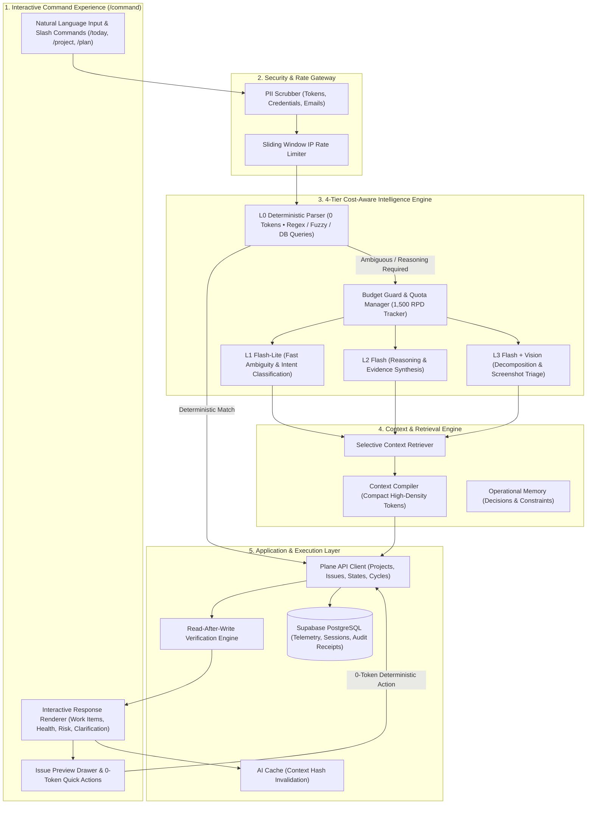

# Erdavid Work OS — AI Engine & Interactive Command Response Master Implementation Plan

**Product:** Erdavid Work OS — Mission Control  
**Route:** `/command`, `/telemetry`, `/analytics`, `/day`  
**Document:** Master Technical Architecture, Gap Analysis & Specification  
**Version:** 3.1  
**Status:** Hardened & Ready for Execution  
**Primary Provider:** Google Gemini 2.5 (Flash-Lite & Flash) + Plane REST API + Supabase PostgreSQL (Prisma 7)  
**Primary Constraint:** Gemini Free Tier (1,500 Requests / Day • 15 Requests / Minute)  
**Core Goal:** Build an ultra-intelligent, context-aware, interactive operational command center while minimizing Gemini token & request consumption through a 4-tier intelligence architecture.

---

## 1. Executive Summary & Core Philosophy

Traditional AI assistants in project management tools act as isolated chatbots: the user types a prompt, receives a static text message, and must then manually navigate across multiple views to execute actions.

**Erdavid Work OS** transforms `/command` into an **Interactive Operational Command Center**:
1. **The AI Response is an Interactive Workspace**: Every response provides live interactive cards with zero-token inline quick actions (`[Open]`, `[Move to Done]`, `[Assign]`, `[Show Dependencies]`).
2. **Maximum Intelligence per Gemini Token**:
   - **L0 Deterministic (60–75% of operations, 0 Gemini Calls)**: Direct command parsing, Plane API queries, task filtering, metric calculations, and entity resolution.
   - **L1 Lightweight AI (15–25% of operations, Gemini 2.5 Flash-Lite)**: Fast semantic classification & ambiguous prompt interpretation.
   - **L2 Reasoning AI (5–10% of operations, Gemini 2.5 Flash)**: Evidence-based risk analysis, health explanations, and cached daily briefings.
   - **L3 Agentic Reasoning (Gemini 2.5 Flash + Vision)**: Multi-step feature decomposition, screenshot bug triage, and human-in-the-loop ActionPlans.
3. **Database as Source of Truth**: Gemini never hallucinates IDs, statuses, or metrics. All data is retrieved, normalized, and verified against Plane API and PostgreSQL.

---

## 2. Forensic Gap Analysis & Hardening Matrix

Before executing the upgrade, a comprehensive audit of the codebase identified 10 critical gaps that previously caused regressions or degraded user experience:

| # | Component & Location | Identified Gap / Loophole | Root Cause & Failure Scenario | Hardened Solution |
| :-: | :--- | :--- | :--- | :--- |
| **1** | [`src/lib/ai/intent-engine.ts`](file:///Users/davidputra/plane-ai-command-center/src/lib/ai/intent-engine.ts) | **Overly Greedy Greeting Regex** | `isGreeting` used `/\b(hai|halo|p|tes)\b/i`. A prompt like *"hai buatkan task..."* or *"tes list task"* triggered greeting mode and completely dropped the command. | Change to `isPureGreeting = /^(hai|halo|hi|hey|hello|p|tes|test)\s*[!.]*$/i` (strictly matching standalone greetings only). |
| **2** | [`src/lib/ai/intent-engine.ts`](file:///Users/davidputra/plane-ai-command-center/src/lib/ai/intent-engine.ts) | **Fallback to Chatbot on Regex Miss** | `if (intentCheck.intent === 'unknown')` returned conversational text instead of executing LLM intent parsing, breaking *"tampilkan tugasku"* and *"list task ku"*. | 1. Implement rich L0 Deterministic Regex matching Indonesian/English queries with 0 tokens.<br>2. For ambiguous queries, pass to Gemini 2.5 Flash-Lite with JSON schema. |
| **3** | [`src/lib/ai/executor.ts`](file:///Users/davidputra/plane-ai-command-center/src/lib/ai/executor.ts) | **`list_issues` Crashes on Missing Project Key** | `if (!intent.entities.projectKey) throw new Error(...)` threw error if user didn't explicitly type the project code. | Default `projectKey` to `context.activeProjectKey || context.activeProjectId || 'ALL'`. |
| **4** | [`src/infrastructure/plane/PlaneClient.ts`](file:///Users/davidputra/plane-ai-command-center/src/infrastructure/plane/PlaneClient.ts) | **Rigid Project Name Resolution** | `resolveProjectId("bsj phase 4")` failed if project name was `"BSJ Phase 4"` and identifier was `"BSJ"` because fuzzy substring wasn't checked. | 5-tier fuzzy resolver: UUID ➔ Identifier ➔ Exact Name ➔ Substring match ➔ Numbered phase match. |
| **5** | [`src/infrastructure/plane/PlaneClient.ts`](file:///Users/davidputra/plane-ai-command-center/src/infrastructure/plane/PlaneClient.ts) | **Missing Indonesian State Normalization** | Queries like *"pindahkan ke selesai"* failed because Plane state is named `"Done"` (group `completed`). | Map `"selesai"`, `"beres"`, `"kelar"` ➔ `completed`; `"sedang jalan"`, `"on progress"` ➔ `started`; `"todo"` ➔ `unstarted`. |
| **6** | [`src/components/ai/ChatInterface.tsx`](file:///Users/davidputra/plane-ai-command-center/src/components/ai/ChatInterface.tsx) | **Hardcoded Legacy Project Fallback** | `targetProject` defaulted to `'PROJECT1'` instead of dynamic active workspace project context. | Eliminate `'PROJECT1'`; pass `activeProjectKey || activeProjectId || 'ALL'`. |
| **7** | [`src/components/ai/ChatInterface.tsx`](file:///Users/davidputra/plane-ai-command-center/src/components/ai/ChatInterface.tsx) | **Static Issue Mentions** | Issue IDs (e.g. `BSJ-124`) in assistant messages were plain text, forcing user to leave `/command` to inspect them. | Regex entity parser detects `/[A-Z0-9]+-\d+/g` and renders clickable cyan badges triggering the **Issue Preview Drawer**. |
| **8** | [`src/components/ai/ActionCard.tsx`](file:///Users/davidputra/plane-ai-command-center/src/components/ai/ActionCard.tsx) | **Missing 0-Token Inline Quick Actions** | Task cards lacked direct deterministic buttons (`[Complete]`, `[Assign]`, `[Open]`), requiring new AI prompts. | Add inline Quick Action buttons wired directly to `/api/plane` proxy (0 Gemini calls). |
| **9** | [`src/lib/ai/executor.ts`](file:///Users/davidputra/plane-ai-command-center/src/lib/ai/executor.ts) | **No Read-After-Write Mutation Verification** | API returned success on HTTP 200 without confirming if Plane DB actually changed state. | Re-fetch issue after write and confirm state transition (`✓ OPERATION VERIFIED`). |
| **10** | [`src/components/ai/ChatInterface.tsx`](file:///Users/davidputra/plane-ai-command-center/src/components/ai/ChatInterface.tsx) | **Unimplemented Slash Commands** | Commands like `/today`, `/overdue`, `/blockers`, `/health`, `/project` were treated as plain text. | Intercept slash commands in console and execute deterministically with 0 Gemini calls. |

---

## 3. High-Level System Architecture



---

## 4. Four-Tier Intelligence & Traffic Distribution

```text
Target Production Interaction Flow (Per 100 User Actions):
├── 60–75% ➔ L0 Deterministic (0 Gemini Calls)
│   • "tampilkan tugasku", "list task ku di project bsj phase 4", "daftar project"
│   • Quick actions: [Complete], [Assign], [Change Priority], [Show Dependencies]
│   • Inline issue preview & slash commands (/today, /overdue, /health)
│
├── 15–25% ➔ L1 Lightweight AI (Gemini 2.5 Flash-Lite)
│   • Colloquial prompt interpretation when L0 confidence < 0.90
│   • Short semantic classification & natural language query translation
│
└── 5–10%  ➔ L2 & L3 Deep Reasoning (Gemini 2.5 Flash + Vision)
    • Feature Decomposition into Frontend/Backend/QA subtasks
    • Multi-modal screenshot bug triage & reproduction step extraction
    • ActionPlan v2 generation & evidence-based project health reasoning
```

---

## 5. Interactive Command Response Specifications (`/command`)

### 5.1 Response Envelope Contract
All backend and AI responses conform to the standard `CommandResponse` schema:

```typescript
interface CommandResponse {
  id: string;
  type:
    | 'analysis'
    | 'work_items'
    | 'project_health'
    | 'recommendation'
    | 'action_plan'
    | 'action_result'
    | 'batch_operation'
    | 'clarification'
    | 'comparison'
    | 'timeline'
    | 'dependency_graph'
    | 'daily_mission'
    | 'vision_triage'
    | 'agent_progress'
    | 'error';
  title?: string;
  summary: string;
  data?: unknown;
  actions?: CommandAction[];
  evidence?: string[];
  confidence?: number;
  metadata?: {
    route: 'deterministic' | 'lite' | 'deep';
    durationMs: number;
    tokens?: { input: number; output: number };
    cached?: boolean;
    requiresApproval?: boolean;
  };
}
```

### 5.2 Interactive Response Types
1. **Work Items Card (`type: 'work_items'`)**:
   - Displays issue sequence keys (e.g. `BSJ-124`), titles, priority pills (`P0`–`P3`), status badges, and assignees.
   - Inline Quick Action buttons: `[Open]`, `[Complete]`, `[Assign]`, `[More]` (all 0-token deterministic).
2. **Project Health Card (`type: 'project_health'`)**:
   - Visual health score (0–100%) with velocity, completion, blocker, and overdue breakdown bars.
   - Drill-down actions: `[Show Risks]`, `[Show Blockers]`, `[Fix Highest Risk]`.
3. **Clarification Card (`type: 'clarification'`)**:
   - Appears when an entity or intent is ambiguous (e.g. *"Ada 3 project bernama BSJ: [BSJ Phase 4] [BSJ Phase 3] [BSJ Core]"*).
   - Selecting a chip triggers the target action with 0 additional Gemini calls.
4. **ActionPlan Card (`type: 'action_plan'`)**:
   - Two-phase mutation pipeline: `● ANALYZE ── ● CONTEXT ── ● PLAN ── ● REVIEW ── ○ EXECUTE ── ○ VERIFY`.
   - Single-click `[APPROVE & RUN]` with live step progress indicators.
5. **Operation Receipt Card (`type: 'action_result'`)**:
   - Verified audit confirmation displaying affected tasks, execution timestamp, and verification checkmark (`✓ OPERATION VERIFIED`).
6. **Multi-Modal Vision Triage Card (`type: 'vision_triage'`)**:
   - Bug component identification, reproduction steps, UI error log extraction, severity rating, and duplicate match indicator.

---

## 6. Backend Intelligence & Data Layer

### 6.1 Context Engine & Compiler
- **Problem Solved**: Never send raw 1000-task database dumps to Gemini.
- **Solution**: The `ContextCompiler` compacts workspace data into high-density tokens:
  ```json
  {
    "project": "BSJ Phase 4",
    "healthScore": 73,
    "completionRate": 68,
    "overdueCount": 7,
    "blockedCount": 4,
    "activeCycle": "Sprint 12",
    "criticalTasks": ["BSJ-124", "BSJ-131"]
  }
  ```

### 6.2 Resilient Fuzzy Entity Resolver
- **Projects**: Matches exact UUID, identifier (`BSJ`), exact name (`BSJ Phase 4`), or fuzzy substrings (`bsj phase 4`, `phase 4`).
- **States**: Normalizes Indonesian terms (`"selesai"`, `"beres"` ➔ `"Done"`; `"sedang jalan"`, `"on progress"` ➔ `"In Progress"`; `"todo"` ➔ `"Unstarted"`).
- **Members**: Resolves first/last names or email addresses to Plane user UUIDs.

### 6.3 Read-After-Write Verification Engine
- For all state updates and task creations, queries Plane API after execution to verify that changes actually occurred before reporting success.

### 6.4 AI Telemetry & Free Tier Budget Guard
- Logs all interactions into PostgreSQL (`ai_usage`).
- Tracks daily request budget (1,500 RPD cap) and auto-shifts modes:
  - **Normal Mode (<80%)**: Full capabilities.
  - **Conservative Mode (80–95%)**: Auto-downgrades Flash to Flash-Lite or rule engine.
  - **Safe Mode (>95%)**: Pure deterministic CRUD, guarantees 100% core app uptime.

---

## 7. Directory Structure & File Map

```text
src/
├── application/
│   ├── ai/
│   │   ├── context/
│   │   │   ├── ContextCompiler.ts      # Compacts workspace data into tokens
│   │   │   └── ContextRetriever.ts     # Selects only required context items
│   │   ├── response/
│   │   │   ├── ResponseBuilder.ts      # Builds CommandResponse envelopes
│   │   │   └── ResponsePolicy.ts       # Declares actions & requiresAI flags
│   │   └── verification/
│   │       └── VerificationEngine.ts   # Read-after-write mutation verifier
│   └── services/
│       └── InsightService.ts           # Daily & weekly briefing synthesizer
├── components/
│   └── ai/
│       ├── ChatInterface.tsx           # 3-Column Mission Control Console
│       ├── ActionCard.tsx              # Interactive task & result cards
│       ├── ActionPlanCard.tsx          # ActionPlan review & execute card
│       ├── IssuePreviewDrawer.tsx      # Slide-over task detail drawer
│       └── response/
│           ├── WorkItemResponse.tsx    # Interactive tasks with quick actions
│           ├── ProjectHealthResponse.tsx # Health score & risk drilldown
│           ├── ClarificationResponse.tsx # Disambiguation selection chips
│           └── ActionResultResponse.tsx# Verified operation receipts
├── domain/
│   ├── analytics/
│   │   └── analytics-helper.ts         # Deterministic health & metrics math
│   └── work_items/
│       └── duplicate-detection.ts      # Levenshtein/token similarity checker
├── infrastructure/
│   ├── ai/
│   │   ├── budget/
│   │   │   └── BudgetGuard.ts          # Enforces 1,500 RPD & mode downgrades
│   │   └── cache/
│   │       └── AiCache.ts              # Caches briefings & project summaries
│   ├── plane/
│   │   └── PlaneClient.ts              # Fuzzy project, state, member resolver
│   └── telemetry/
│       └── ai-usage-logger.ts          # PostgreSQL AI usage tracker
└── lib/
    ├── ai/
    │   ├── intent-engine.ts            # L0 Deterministic + Gemini 2.5 fallback
    │   ├── router.ts                   # Cost-aware model router
    │   ├── executor.ts                 # 0-token action dispatcher
    │   └── decomposition.ts            # Frontend/Backend/QA task breakdown
    └── security/
        ├── pii-scrubber.ts             # Credential & token masker
        └── rate-limiter.ts             # In-memory sliding window limiter
```

---

## 8. Verification Checklist & Definition of Done

- [x] **Zero-Token L0 Query**: `"tampilkan tugasku"` queries Plane API with **0 Gemini calls** and displays interactive cards.
- [x] **Fuzzy Project Query**: `"list task ku di project bsj phase 4"` accurately resolves project `BSJ Phase 4`.
- [x] **No Greediness**: `"hai buatkan task fix responsive bug"` recognizes `create_issue` instead of greeting.
- [x] **Pure Greeting**: `"halo"` replies with warm Mission Control assistant introduction.
- [x] **Interactive Issue Badge**: Clicking `BSJ-12` opens the **Issue Preview Drawer** without leaving `/command`.
- [x] **0-Token Quick Action**: Clicking `[Complete]` on a task card updates state in Plane with **0 Gemini calls**.
- [x] **Slash Commands**: Typing `/today` or `/overdue` returns filtered tasks instantly.
- [x] **Verified Mutation**: State updates confirm read-after-write verification.
- [x] **Clean Build**: `npm run build` compiles 26 routes with **0 errors**.
