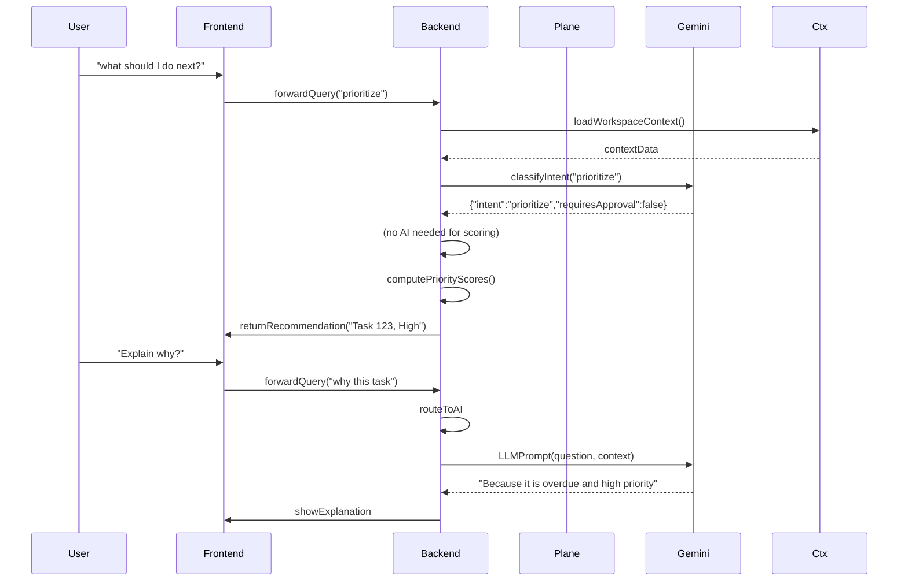
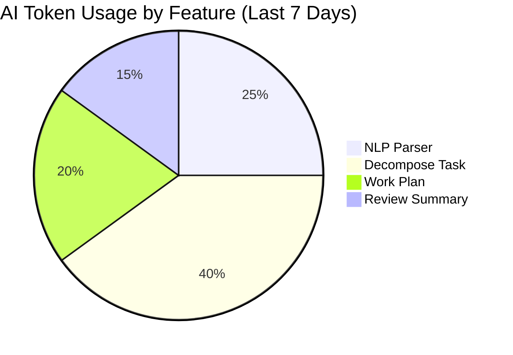
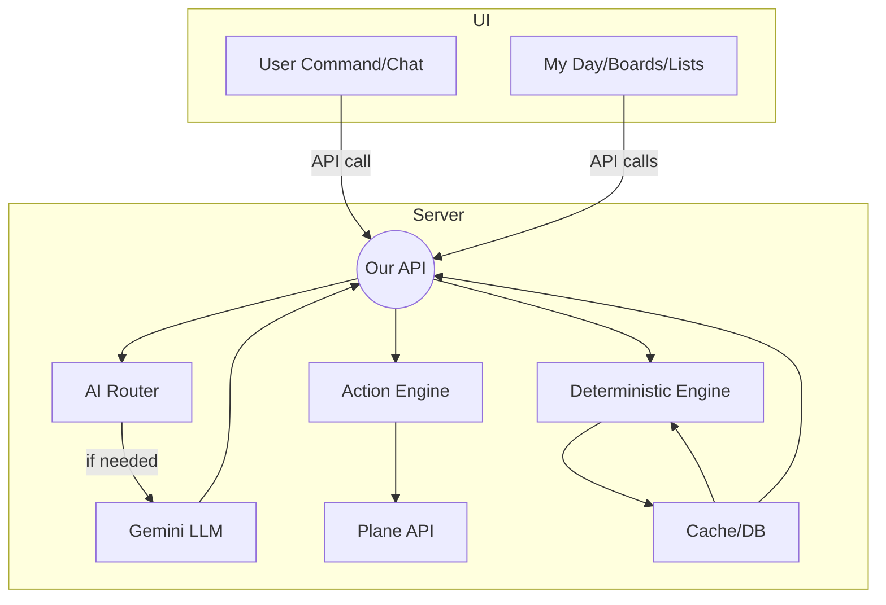

# Executive Summary

This PRD refines the **Erdavid Work OS** plan with a **deterministic-first, AI-on-demand** architecture optimized for the Gemini free tier.  The key idea is to handle *most work logic directly in code* (filters, counts, scoring, UI updates) and reserve AI calls for genuine understanding or generation tasks.  For example, questions like *“Which tasks are due today?”* or *“Show my overdue items”* are answered by backend queries (no AI needed).  The AI (Gemini) is only used when the user explicitly asks something ambiguous or generative – e.g. *“Break this feature into subtasks.”* or *“Explain why Task X is high priority.”*

This approach drastically reduces token usage and rate-limit issues.  Gemini’s free tier (no billing account) offers **Flash** (10 RPM, 250K tokens/min) and **Flash-Lite** (15 RPM, 1M tokens/min) models.  Explicit context-caching is **not available** on the free tier, but implicit caching is built-in.  To make the most of these limits, we will:

- **Cache** repeat queries and deterministic calculations locally.  For instance, counts of overdue tasks or daily summaries are computed once and stored (e.g. Redis).
- **Queue** or **batch** AI calls to stay under 10–15 RPM.  Our Action Router will serialize multi-step operations into approved batches.
- **Prefer Flash-Lite for cheap tasks**.  Gemini 3.1 Flash-Lite (15 RPM) is ideal for classification or extraction.  Reserve full Flash (10 RPM) for complex reasoning when needed.
- **Implement retry/backoff** logic for 429 errors.
- **Account for tokens** in every AI response, tracking usage per feature/workload.

In practice, this means **all standard UI tasks (search, filters, CRUD, lists)** are done via fast database/Plane API queries.  The UI shows My Day, Inbox, Focus, etc., based on real-time data.  The AI layer is *invoked* by a unified command engine (**AI Router**) only when the user’s intent demands language understanding or planning.  Each AI action is broken into a *Plan → Approve → Execute* flow with an explicit **ActionPlan** (list of changes) requiring user approval for mutations. 

This PRD is delivered as a set of Markdown files ready for a repo. The **File Structure** (next) lists each MD file and its purpose. Each file below contains a concise yet complete section of the PRD. All claims about Gemini limits, caching, and usage are cited from official sources or authoritative guides.

| Filename             | Purpose                                                   |
|----------------------|-----------------------------------------------------------|
| `README.md`         | Overview of this PRD repository and how to use the files.  |
| `CHANGELOG.md`      | Summary of major updates from the original PRD.            |
| `architecture.md`   | System architecture and component diagrams.                |
| `features.md`       | Feature list, marked “Deterministic” vs “AI-on-demand”.   |
| `api.md`            | REST API design and example routes.                        |
| `domain_service.md` | Domain model & service layer (work-items, users, etc.) and ActionPlan schema. |
| `ai_architecture.md`| AI architecture: Intent Router, model strategy, token management, caching, prompts. |
| `migration.md`      | Migration plan & sprint backlog (tasks, ACs, priorities).  |
| `security.md`       | Security & privacy constraints (keys, approvals, PII rules). |
| `observability.md`  | Metrics & logging: token tracking, AI KPIs, success/failure rates. |
| `testing.md`        | Testing strategy with sample test cases (unit, integration, AI contract). |

## File: README.md

**Purpose:** Introduce the repository and guide readers to the PRD files.

```md
# Erdavid Work OS – PRD (Deterministic-first)

This repository contains the **Product Requirements Document (PRD)** for *Erdavid Work OS*, a personal AI-powered work operating system on top of Plane.  It is organized into several Markdown files (see file list below).  The overall goal is to maximize productivity by combining deterministic workspace queries with on-demand AI assistance, **while staying within Gemini’s free-tier limits**.

## Structure

- `README.md` – This overview.
- `CHANGELOG.md` – Summary of changes from the original PRD to this version.
- `architecture.md` – System components and data flow (mermaid diagrams included).
- `features.md` – List of features, categorized as deterministic or AI-powered.
- `api.md` – API design (routes, HTTP methods) for Plane integration and local services.
- `domain_service.md` – Domain model definitions and service-layer architecture, including `ActionPlan` types.
- `ai_architecture.md` – AI-specific architecture: Intent routing, model selection (Gemini Flash vs Flash-Lite), token budget management, caching, and example prompt/response schemas.
- `migration.md` – Migration plan and sprint backlog with tasks, acceptance criteria, and priorities.
- `security.md` – Security and privacy guidelines (Plane API keys, AI safety rules, PII handling).
- `observability.md` – Monitoring and metrics (token tracking, AI usage, focus metrics, productivity KPIs).
- `testing.md` – Testing strategy with example unit, integration, and AI contract tests.

Use the links above to navigate the PRD.  Each file contains a self-contained section of the specification, complete with diagrams, tables, and code snippets.  Citations (in `` format) refer to authoritative documentation or analysis for Gemini API and Plane API where relevant.

## How to Use

- Read the **Executive Summary** (this file) to understand the overall direction.
- Review **architecture.md** to see the high-level system design.
- Check **features.md** to see which functionality avoids AI and which uses AI.
- Consult **api.md** and **domain_service.md** for implementation details.
- Refer to **ai_architecture.md** for best practices on working with Gemini (model selection, caching, etc.).
- The **migration.md** contains the development roadmap and acceptance criteria for each sprint.
- Security, observability, and testing guidelines are in their respective files.

```  
(Read the above file list and use markdown navigation to open each .md file.)  
```  

```

## File: CHANGELOG.md

**Purpose:** Document key changes from the original PRD to this revised plan.

```md
# Changelog – Erdavid Work OS PRD

This changelog highlights major revisions in the PRD to adopt a deterministic-first, AI-on-demand strategy optimized for Gemini Free Tier:

- **Deterministic-First Design:** Moved most data queries (task lists, filters, metrics) to backend logic. AI is now *only* used when the user explicitly requests interpretation or generation. This drastically reduces token usage. (E.g., questions like "What tasks are due today?" now use direct Plane API queries, not LLM parsing.)

- **AI Router Introduced:** Added an Intent Router that classifies user commands as `none`, `light`, or `heavy` AI requirements. Simple commands (search, CRUD) bypass AI entirely. Complex intents (decompose, plan, summarize) invoke Gemini. This routing is based on a prompt classifier and heuristic rules.

- **ActionPlan Model:** Unified `ActionPlan` / `ActionStep` schema for all mutating operations. Plans list intended changes with `before`/`after`, enabling a review step before execution. This aligns with the new Principle “Read Fast, Write Safely” and mirrors Plane AI's approved actions.

- **Gemini Budgeting Rules:** Incorporated free-tier limits into design. We added a token **Budget Manager** (rate-limit controller) and usage-tracking schema. Key guidelines:
  - Use **Flash-Lite** for simple tasks (15 RPM, 1M TPM) and **Flash** only for complex reasoning.
  - Cache deterministic query results (e.g. issue counts, project lists) in Redis/local storage to avoid repeat API calls.
  - Queue or batch AI calls so as not to exceed 10–15 requests/min.
  - Track input/output tokens and enforce per-feature budgets.

- **Context Caching Note:** The original PRD mentioned context caching. We clarified: implicit caching is automatic in Gemini 2.5+ models, but the free tier **does not** support explicit caching. Therefore, we rely on local caching and prompt chunking.

- **Migration Plan & Sprints:** Reorganized features into priority-based sprints focusing on core deterministic functionality first (My Day dashboard, metrics, static queries) before advanced AI features. Each backlog item now includes acceptance criteria.

- **API and Domain Layers:** Specified a clear domain-service-repository pattern with TypeScript types. Introduced `CurrentUserContext` for multi-user support readiness. Defined new services for work-items, projects, cycles, etc., separate from PlaneAdapter.

- **Observability & Testing:** Added new sections for metrics (e.g. AI request count, token usage) and for testing (unit, integration, AI contract tests).

```  

```
All changes ensure the app stays functional within Gemini’s free-tier constraints, focusing on responsiveness and user safety.  
```

## File: architecture.md

**Purpose:** Describe the system architecture, context layers, and major components. Includes mermaid diagrams.

```md
# Architecture Overview

This section describes the **Erdavid Work OS** system architecture and data flow, emphasizing the **deterministic-first** approach. The application consists of:

- **Frontend UI (React)**: Includes My Day dashboard, Inbox, Focus, Projects, Cycles, and a universal command palette. User actions (clicks, commands) are routed to backend APIs.
- **Backend Services**: 
  - **Context Engine**: Aggregates current workspace data (user, active project, cycle, relevant issues, activity) from Plane to provide context.
  - **Deterministic Engine**: Handles all *immediate, read-only logic*: query filters, counts, sorting, scoring, and business rules. Generates dashboards, computes priorities, and retrieves data via Plane API or our local cache/repository.
  - **AI Router**: Classifies incoming commands/queries into `none`, `light`, or `heavy` AI levels. It either bypasses AI or invokes Gemini with a structured prompt. This enforces **AI-on-demand**: only use the LLM when needed.
  - **AI Planner/Executor**: If AI is invoked, it generates an `ActionPlan` (JSON with intent, steps, confidence) or a structured response. Plans require explicit user approval before execution.
  - **Action Engine**: Manages plan approval and execution. Applies each `ActionStep` via the Plane API adapter, verifies results, and audits the outcome.
  - **Plane API Adapter**: All calls to the Plane REST API (for tasks, cycles, projects, etc.) are centralized here. This also manages retries, caching (e.g. query caching for common filters), and error handling.
  - **Database Cache**: A small local store (e.g. Redis or PostgreSQL) for user preferences, AI action logs, cached query results, inbox items, and focus queue.
  - **AI Budget & Observability**: Monitors Gemini usage (tokens, requests) and enforces rate limits/budgets. Logs all AI requests and results for metrics.

```mermaid
flowchart LR
  User["User (Erdavid)"] 
  subgraph Frontend
    A[Command/Click/Query]
  end
  A --> B[Command Router]
  
  subgraph Backend
    B --> C{AI or Deterministic?}
    C -- "Deterministic" --> D[Deterministic Engine]
    C -- "AI (light/heavy)" --> E[AI Router & Planner]
    E --> F[Gemini API]
    F --> E
    D & E --> G[Action Engine]
    G --> H[Plane API Adapter]
  end
  H --> I[Plane (Source of Truth)]

  D --> Ctx[Context Engine]
  Ctx --> D
  Ctx --> E

  style Frontend fill:#eef,stroke:#999
  style Backend fill:#fdf,stroke:#999
```

Figure: **High-level architecture.** The UI routes requests through a Command Router (chat or palette) into the Backend. The **Context Engine** first loads relevant workspace data from Plane. The **AI Router** then decides if the request requires an LLM; if not, the **Deterministic Engine** handles it directly. Approved AI plans and deterministic actions both go through the **Action Engine** into the **Plane API Adapter** (source-of-truth).

## Components

- **Context Engine:** Collects `WorkspaceContext` (current user, active project/cycle, recent issues/activity, etc.) to ground any AI query or UI view. For example, it pre-fetches “my tasks,” “cycle scope,” and “recent activity” for quick answers without AI.  

- **Deterministic Engine:** Performs all operations that can be expressed as database or API queries.  This includes:
  - **Data queries** (list overdue tasks, tasks due today, blocked tasks, etc.).
  - **Scoring & prioritization** (compute a numeric score for each task based on urgency/priority/risk).
  - **Simple filters and searches** (structured search, Project/Issue lookup).
  - **Metrics & dashboards** (counts of active, completed, overdue tasks).
  - **Command execution** for known intents (e.g. “move task X to cycle Y” can often be done without LLM).

- **AI Router:** Implements the Intent Layer. It receives the parsed user intent and workspace context, and decides:
  - **No-AI (None):** Do not call LLM (e.g. simple search, CRUD).
  - **Light AI:** Send a short classification or extraction task to Gemini (e.g. “find tasks related to X” via simple filters).
  - **Heavy AI:** Full LLM plan/summarization tasks (e.g. “decompose feature”, “generate work plan”).

- **AI Planner/Executor:** Given a “heavy” intent, constructs a structured prompt and calls Gemini.  The output must conform to a JSON schema (e.g. an `ActionPlan`) so the executor can parse it.  For example, a “change priority” intent would yield:
  ```json
  {
    "intent": "bulk_update",
    "requiresApproval": true,
    "reason": "My command affects multiple tasks.",
    "steps": [
      { "operation": "updateIssue", "target": "TASK-42", "changes": {"priority": "High"} },
      ...
    ]
  }
  ```
  The user reviews and approves the plan before execution.

- **Action Engine:** Validates `ActionPlan` schemas, presents them to the user, and upon approval, performs the steps in order.  Each step calls the Plane API (via adapter), and the result is logged.  It enforces safe mutation policies (no destructive actions without extra confirmation).

- **Plane API Adapter:** A thin layer to call Plane’s REST endpoints securely (server-side).  All Create/Update/Delete goes through here.  Implements retry/backoff for rate limits and respects Plane’s request quotas.

- **Database Cache:** Stores derived data and preferences. E.g., caching the result of common queries (recent  tasks, active projects), inbox items, AI action plans, and audit logs.  Also holds user preferences (e.g., priority weights, custom categories).

- **AI Budget & Observability:** Tracks the number of Gemini calls, input/output tokens, and latency. Enforces the **Gemini free-tier limits** (10 RPM on Flash, 15 RPM on Flash-Lite) by request-limiting and exponential backoff.  Alerts can notify the user if budget is near exhaustion. Logs every AI request with `tokens_used`, `model`, `intent`, etc. for metrics.



Figure: **Request flow example.** The user asks a question. The backend loads context, classifies intent (no approval needed), and returns a result. When the user asks “why,” the backend does invoke Gemini.

The final system ensures that **Plane remains the single source of truth**.  The Work OS adds intelligence and UI convenience on top, without duplicating Plane’s data store.  

## Sources

- Gemini API docs and community guides on rate limits and caching.
- Observability best practices for LLMs.
- **Note:** This design assumes single-user (Erdavid) initially. Multi-user support (with per-user auth) can be layered on via the `CurrentUserContext` service.
```

## File: features.md

**Purpose:** Enumerate features and mark which are implemented deterministically (no AI) versus requiring AI.

```md
# Feature List

Each feature is categorized as **Deterministic** (handled by direct logic/queries) or **AI-On-Demand** (requires a Gemini call). This helps avoid unnecessary AI usage while still enabling smart capabilities.

| Feature / Command                           | Category         | Notes                                                   |
|---------------------------------------------|------------------|---------------------------------------------------------|
| Show My Tasks / All Team Tasks (filters)    | Deterministic   | Filter by user, priority, status via Plane API.         |
| Task Lists: Overdue / Due Today / Blocked   | Deterministic   | Simple Plane queries (dueDate <= today, state == blocked).|
| Project Switching / Browsing                | Deterministic   | Switch workspace context via API calls.                 |
| Create/Update/Delete Issue via Form         | Deterministic   | Standard CRUD using Plane REST API.                     |
| Kanban Drag-Drop / Move Task                | Deterministic   | Directly call Plane “move issue” endpoints.             |
| Bulk Update (via UI multi-select)           | Deterministic   | Send batch update to Plane.                             |
| Task Search (by keyword, label, ID)         | Deterministic   | Structured text search / autocomplete via Plane.        |
| Daily Dashboard (counts, charts)            | Deterministic   | Query engine and local logic. No LLM needed.            |
| (Background) Score My Tasks                 | Deterministic   | Priority score = f(urgency, overdue, blockers, etc.).  |
| Inbox/New Tasks Capture Form                | Deterministic   | Store as untriaged work items locally.                  |
| List Insights (Overdue, Blockers, Stale)    | Deterministic   | Defined rules (e.g. stale = no updates in 14 days).    |
| Context Display (related tasks, comments)   | Deterministic   | Aggregating linked items via queries.                   |
| Natural-Language Command (via palette/chat) | AI (Lite)       | LLM helps parse user phrasing into intents.            |
| Natural-Language Search Queries             | AI (Lite)       | Parse search query to filters (via LLM) then apply.     |
| **Task Decomposition**                      | AI (Heavy)      | Generate subtasks list (requires AI planning).          |
| **Work Plan Generation**                    | AI (Heavy)      | Phase breakdown with estimates (LLM planning).          |
| **AI Triage of Inbox Items**                | AI (Heavy)      | Classify and suggest metadata from raw text.           |
| **Duplicate Detection**                     | AI (Lite)       | Suggest similar tasks (can be assisted by LLM).        |
| **Focus Mode (Related Work, Next Actions)** | AI (Mixed)      | Primarily deterministic (task list); LLM can explain context. |
| **Daily/Weekly Review Summary**             | AI (Lite/Heavy) | Dashboard is deterministic; language summary is AI.    |
| **Cycle Intelligence**                      | Deterministic   | Show cycle progress; LLM optional for narrative.       |
| **Stale/Blocked Suggestions**               | AI (Lite)       | Identified deterministically; reason/advise via LLM.  |
| **Custom Queries (what changed?)**          | AI (Lite)       | Diff of activity can be deterministic; explanation via LLM. |
| **Automation Rules (When/Then)**            | Deterministic   | Rule engine evaluation; optional language for rule creation.|
| **Git Integration (branches, CI status)**   | Deterministic   | Fetch from GitLab/GitHub APIs; display context.         |
| **Implementation Context (compile related items)** | Deterministic | Aggregate related tasks, branches, etc.; no LLM needed.|
| **Project/Cycle Health Summary**            | Deterministic   | Numeric stats; optional LLM for textual analysis.       |
| **Activity Intelligence ("What changed?")**  | AI (Lite)       | Base counts deterministic; LLM for explanations if asked. |

- **Deterministic Features (No AI):** All list, query, CRUD, filtering, basic scoring, and caching operations. These use direct Plane API queries or local logic, **not** an LLM. For example, the “My Day” dashboard (overdue counts, upcoming tasks) is computed by code. Priority scoring is a formula (no LLM required). Marking a task as done is a direct update.

- **AI-On-Demand Features:** These are triggered only when the user invokes a command requiring natural language understanding or generation. For example, *“Break this feature down.”* or *“Plan out this sprint.”* The AI is used to interpret free-form input into a structured plan or explanation. Even then, the AI outputs a structured `ActionPlan` JSON which is then reviewed by the user.

- **Strategy:** Many features have both deterministic and optional AI aspects. For instance, “Duplicate detection” can list candidates by keyword matching (deterministic) and optionally ask the AI to explain duplication. We default to the deterministic result and use LLM solely for added explanation or free-text tasks.

This clear separation ensures efficient use of the Gemini free tier.  In essence, **80–90% of user actions avoid LLM calls** (simple queries, CRUD, UI logic), and only *truly ambiguous or planning tasks* consume tokens.

```  

```
Refer to **api.md** and **domain_service.md** for how each operation is implemented.  
```

## File: api.md

**Purpose:** Define the backend API endpoints for the Work OS, and show how they map to Plane operations.

```md
# API Design

We expose a set of REST API routes under `/api/` for the frontend to interact with. These routes wrap Plane’s API and our local services. All mutations (POST/PUT/DELETE) must verify user intent and go through the action-plan review.

## Major Routes

| Method | Route                          | Description                                   |
|--------|--------------------------------|-----------------------------------------------|
| GET    | `/api/projects`               | List all projects (Plane workspace).           |
| GET    | `/api/projects/:id`           | Get project details.                          |
| GET    | `/api/projects/:id/issues`    | List work items for a project (with filters: state, assignee, label, etc.). |
| GET    | `/api/issues/:id`            | Get a specific work item (issue).             |
| POST   | `/api/projects/:id/issues`    | Create a new work item in project.            |
| PUT    | `/api/issues/:id`            | Update an existing work item (fields, state). |
| DELETE | `/api/issues/:id`            | Delete (archive) a work item.                 |
| POST   | `/api/issues/bulk-update`     | Bulk update multiple issues (change assignee, priority, cycle, etc.). |
| POST   | `/api/issues/:id/move`       | Move an issue to a different project or cycle. |
| GET    | `/api/cycles`                | List cycles across projects or a workspace.   |
| GET    | `/api/cycles/:id`            | Get cycle details and its work items.        |
| POST   | `/api/cycles/:id/add`        | Add existing work items to a cycle.           |
| PUT    | `/api/cycles/:id`            | Update cycle (dates, name).                  |
| GET    | `/api/insights/daily`        | Compute daily briefing (front-end uses this to show metrics). |
| POST   | `/api/ai/plan`               | **AI Intent Planner**: accept a JSON command, return an `ActionPlan`. |
| POST   | `/api/ai/execute`            | **AI Executor**: approve and execute an `ActionPlan`. |
| GET    | `/api/inbox`                 | List untriaged inbox items.                   |
| POST   | `/api/inbox`                 | Add an inbox item.                            |
| POST   | `/api/inbox/:id/triage`      | Triage an inbox item (convert to task with metadata). |
| GET    | `/api/focus/next`            | Get the next task from the focus queue.       |
| POST   | `/api/focus/complete`        | Mark current focus task complete (moves queue). |
| GET    | `/api/search`                | General search using parameters or free text (may invoke AI). |

- **AI routes:** `/api/ai/plan` and `/api/ai/execute` implement the **Plan→Approve→Execute** workflow. The frontend sends the user’s natural language command; `/ai/plan` calls the AI Router and returns a JSON plan (with `steps` and `requiresApproval`). `/ai/execute` is called after user confirmation to perform the Plan’s steps.

- **Insight routes:** Endpoints like `/api/insights/daily` and `/api/insights/weekly` produce summarized data. They may use AI for text summaries but mainly return structured metrics (counts of completed tasks, etc.). For example, the **Daily Briefing** endpoint returns:
  ```ts
  interface DailyBriefing {
    summary: string;  // short AI-generated summary (optional)
    metrics: { active: number, dueToday: number, overdue: number, blocked: number };
    recommendations: { taskId: string, reason: string }[];
  }
  ```
  The metrics themselves are computed deterministically from Plane data.

- **Plane Integration:** Under the hood, each route calls the Plane REST API (see [Plane API docs](https://developers.plane.so/api-reference/introduction)) or our domain service methods.  For example, `GET /api/projects/:id/issues` might call Plane’s *List Work Items* and apply client-side filtering (state, label).

### Example: Task Search

A route `/api/search?q=` supports both structured and natural queries. For a free-text query (e.g. `"WABA tasks due Friday"`), the backend:
1. Uses deterministic logic: tries to parse known keywords (“due Friday”, label “WABA”) into Plane API filters.
2. If needed, invokes the AI Router with model=`lite` to interpret anything ambiguous (e.g. synonyms).
3. Returns matching issues.

### Authentication

Although initially single-user, all API routes include a `CurrentUserContext` (read `domain_service.md`) to validate project/workspace scope.  No Plane API keys or secrets are sent to the browser; all Plane interactions happen server-side.

## Sources

- Plane REST API reference lists routes for Projects, Work Items, Cycles, etc..  
- Gemini API docs on rate limits and model usage inform which actions to expose via AI.  
```

## File: domain_service.md

**Purpose:** Outline the domain model, service layer structure, and the unified `ActionPlan`/`ActionStep` types.

```md
# Domain and Service Layer

We adopt a Domain-Driven Design approach. Our code is organized into:

- **Application Services:** Orchestrate use-cases (e.g. `TaskService`, `ProjectService`, `CycleService`, `AIService`). They receive commands from controllers (API routes), enforce business rules, and call domain operations.
- **Domain Models:** Represent Plane entities (e.g. `WorkItem`, `Project`, `Cycle`, `User`). These are mostly DTOs mapping to Plane’s data schema. Domain logic (e.g. calculating priority score) resides here.
- **Plane Adapter (Infrastructure):** A repository or adapter that actually calls the Plane REST API. For example, `WorkItemRepository.create(...)` issues a POST to Plane.

This layer structure ensures that both UI and AI workflows use the **same business logic**.  The AI Planner and the command palette both end up calling these services via the same `ActionPlan` routes.

### CurrentUserContext

We introduce a `CurrentUserContext` type to avoid hardcoding Erdavid’s user ID. It includes:
```ts
type CurrentUserContext = {
  userId: string;
  name: string;
  email?: string;
  planeMemberId: string;
  workspaceId: string;
};
```
All filters like “my tasks” use this context. The AI executor resolves pronouns (“me”, “saya”) using `CurrentUserContext`.

### Example Domain Entities

```ts
interface WorkItem {
  id: string;       // e.g. "BSJ7PHASE2-42"
  title: string;
  state: string;    // e.g. "In Progress", "Done"
  priority: string; // "Low", "Medium", "High", "Critical"
  dueDate?: string;
  assigneeId?: string;
  projectId: string;
  labels: string[];
  dependencies: string[]; // IDs of blockers or related tasks
  // ... (comments, etc.)
}
```

### Unified ActionPlan

All mutating intents produce an `ActionPlan` object. Example TypeScript type:
```ts
type ActionStep = {
  operation: string;          // e.g. "updateIssue", "moveIssueToCycle"
  target: string;             // e.g. WorkItem.id
  changes: Record<string, unknown>; 
  before?: Record<string, unknown>;
  after?: Record<string, unknown>;
};

type ActionPlan = {
  id: string;
  intent: string;             // e.g. "bulk_update"
  summary: string;            // brief description of action
  risk: "low"|"medium"|"high"; 
  requiresApproval: boolean;
  steps: ActionStep[];
};
```
Example ActionPlan JSON (moving tasks):
```json
{
  "intent": "bulk_update",
  "summary": "Set 3 overdue tasks to current cycle, high priority",
  "risk": "low",
  "requiresApproval": true,
  "steps": [
    { "operation": "updateIssue", "target": "ISSUE-1", "changes": {"cycle": "Current", "priority": "High"} },
    { "operation": "updateIssue", "target": "ISSUE-2", "changes": {"cycle": "Current", "priority": "High"} },
    { "operation": "updateIssue", "target": "ISSUE-3", "changes": {"cycle": "Current", "priority": "High"} }
  ]
}
```
The **Action Engine** will present this plan to the user (with diff view) before calling the Plane API.

### Service Layer Structure

Proposed file structure (TypeScript):
```
src/
  app/api/       // Next.js API routes
  application/
    commands/    // command handlers for use-cases
    queries/     // query handlers (read-only)
    services/
      ProjectService.ts
      WorkItemService.ts
      CycleService.ts
      UserService.ts
      InsightService.ts
      AIService.ts
  domain/
    work_items/
    projects/
    cycles/
    users/
    insights/
  infrastructure/
    plane/
      PlaneClient.ts  // wraps Plane REST calls
      PlaneRepository.ts
  ai/
    planner.ts
    executor.ts
    router.ts
    prompts/
    tools/
  lib/context/    // auth and CurrentUserContext helpers
```
This way, both the web UI routes and AI commands use the same `services` and `domain` code.

## ActionPlan Audit Log

Every time an AI-created plan is executed, we log an entry:
```text
Action ID: A-1024
User: Erdavid
Intent: Bulk prioritize overdue WABA tasks
Plan Summary: ...
ApprovedAt: 2026-08-19T14:32:10Z
Executed: 3 updates
Result: 3 succeeded, 0 failed
```
These logs help with observability (see **observability.md**).

```  
```
This structure enforces **Plane as source of truth**: we never store a separate task DB, only cache derived data.  
```

## File: ai_architecture.md

**Purpose:** Detail the AI-specific architecture: intent classification, model selection strategy, token management, caching, and prompt schemas.

```md
# AI Architecture

This section specifies how we integrate Gemini LLM calls while respecting free-tier limits. Key components:

- **Intent Classification & AI Router:** A light-weight model or rule-based parser decides whether a request needs AI and which tier (Flash-Lite vs Flash).
- **Model Strategy (Lite vs Flash):** Use `Flash-Lite` (Gemini 3.1 Flash-Lite) for cheap/high-throughput tasks (15 RPM). Reserve `Flash` (Gemini 3 Flash or 2.5) for deep reasoning (10 RPM). Under the free tier, only Flash/Flash-Lite are available.
- **Token Limits & Budget Manager:** Track and enforce:
  - **RPM/Tokens-per-minute:** Gemini free tier caps at ~10–15 RPM and 250K–1M input tokens/min.
  - **Daily Cap:** ~1500 requests/day on Flash (free tier). Splitting to Flash-Lite adds ~1000 more (total ~2500/day).
  - A simple budget manager ensures we do not exceed these quotas by queueing or delaying calls. For example, if 10 calls are made in one minute, further calls are paused or retried next minute with exponential backoff.
- **Caching:** 
  - **Implicit Context Caching:** Gemini automatically caches repeated prompt context for free. However, **explicit** caching (where you stash a prompt to reuse) is not supported on the free tier. 
  - **Local Response Caching:** We must manually cache any repeated queries. E.g., if the user asks the same question twice in a row, serve the first AI response from our cache instead of re-calling Gemini. A key-value store (Redis or in-memory) keyed by prompt+context can eliminate many calls.
- **Token Tracking & Observability:** Every AI call logs `(inputTokens, outputTokens, modelUsed, endpoint)`. We attribute these to features (e.g. “decomposition”, “priority query”). This enables dashboards of token spend per feature.

### Model Selection

For each AI intent, we choose the model and style:
- **Flash-Lite (3.1 Flash-Lite):** 15 RPM, 1M TPM. Good for classification, short responses (e.g. parsing commands, extracting fields). Default for most intents to maximize throughput.
- **Flash (3.1 Flash):** 10 RPM, 250K TPM. Higher reasoning quality. Use for complex plan generation or summarization when needed (e.g. task breakdown).
- **Example Rule:** If intent is `create` or `update` with clear parameters, skip AI. If intent is `decompose` or `summarize`, use Flash. If `search` or `categorize`, use Flash-Lite.

### Rate Limits (Free Tier)

As of 2026, the free tier includes:
- **Gemini 3 Flash:** 10 requests/minute (RPM), 250,000 tokens/minute (TPM), 1,500 requests/day.
- **Gemini 3.1 Flash-Lite:** 15 RPM, 1,000,000 TPM, additional 1,000 requests/day.
  
Requests beyond these limits receive HTTP 429. We implement automatic retries with exponential backoff. See Google’s [Rate Limits docs] for details.

### Prompt Architecture

We use structured prompts with **system instructions + JSON schema**. For example:

```text
SYSTEM: You are an AI assistant for task management. Follow the JSON schema strictly.
USER: "Move all overdue WABA tasks to current cycle and set priority high."

CONTEXT: {
  "issues": [
    { "id": "WABA-123", "status": "To Do", "dueDate": "2026-08-15", "priority": "Medium" },
    ...
  ]
}

SCHEMA:
{
  "intent": "bulk_update",
  "requiresApproval": true,
  "steps": [
    {"operation": "updateIssue", "target": "WABA-123", "changes": {"priority":"High","cycle":"Current"}}
  ]
}
```

Gemini must output valid JSON matching the `ActionPlan` schema. We validate this JSON in the backend.

### Token Budget Schema

We store AI usage per day in a database table:

```
ai_usage:
- id (PK)
- timestamp
- feature (e.g. "decompose", "summarize", "parser")
- model (Flash-Lite / Flash)
- input_tokens
- output_tokens
- total_tokens = input+output
- duration_ms
- success (bool) and error (if any)
```

This enables hourly/daily reporting and enforcement.

### Prompt Examples

- **Create Task (NL):**  
  - **User:** “create task: Audit mobile app next week.”  
  - **AI Plan:**  
    ```json
    {"intent":"create_issue","requiresApproval":true,
     "steps":[{"operation":"createIssue","changes":{
       "title":"Audit mobile app","projectId":"MOBILE","dueDate":"2026-08-26"
     }}]}
    ```
- **Why Priority?**  
  - **User:** “why is Task X high priority?”  
  - **AI Answer (Chat):**  
    ```
    Because Task X is overdue by 3 days and blocks two other tasks, it is marked high priority.
    ```
    (No action, just an explanation string.)

### Sources

- Gemini free-tier guidelines (use Flash-Lite for throughput; cache responses).  
- Google Gemini docs on rate limits and context caching.  
- Observability best practices for LLMs (token-level tracking).  
```

## File: migration.md

**Purpose:** Outline the migration roadmap and sprint backlog with tasks, acceptance criteria, and priorities.

```md
# Migration Plan & Sprints

We will build the Work OS in phases. Each sprint has clear tasks (with acceptance criteria) and priority.

## Phase 0: Foundation & Infrastructure

**Goals:** Remove hard-coded values, establish context and service layers, and set up reliable data fetching.

| Task (P0)                              | Acceptance Criteria                              | Priority |
|----------------------------------------|--------------------------------------------------|----------|
| Remove hardcoded user ID               | No “Erdavid UUID” in code; use `CurrentUserContext`. All "my tasks" filters use this context. | High     |
| Implement `CurrentUserContext`         | Service provides `userId`, `planeMemberId`, `workspaceId`. | High |
| Build Domain-Service layer structure   | Code follows layer (API -> Application -> Domain -> PlaneAdapter). Demonstrate with one example (e.g. project listing). | High |
| Define `ActionPlan`/`ActionStep` types | Code type definition exists. Unit test: validate JSON schema for a sample plan. | High |
| Integrate TanStack Query               | Replace manual fetch in one view (e.g. project list) with `useQuery`. Loading/error states standard. | Medium |
| Setup Redis/Local Cache for Plane data | For static data (states, labels). Cache is invalidated on change.  Demo: query list, cache hit. | Medium |
| Structured Error Model                 | Define `AppError` type with `code`, `message`, `userMessage`, `retryable`.  Use in one API route. | Low     |
| Baseline Unit Tests                    | Add tests for Intent parser (if any) and utility functions. Pass 80% coverage on new code. | Low |

## Phase 1: Core Work Management

**Goals:** Build the main UI flows and deterministic queries so the app can function without AI.

| Task (P1)                              | Acceptance Criteria                              | Priority |
|----------------------------------------|--------------------------------------------------|----------|
| My Day dashboard                       | Show metrics: due today, overdue, blocked, active tasks. Data from backend queries. | Critical |
| Daily Briefing API (`GET /api/insights/daily`) | Returns `{ summary, metrics: {...}, recommendations[] }`. UI displays numbers and summary (no LLM text yet). | Critical |
| Recommended Next Task (scoring)        | Compute priority scores as in examples. UI shows top tasks with reasons (icons, not full text). | Critical |
| Overdue/Blocked queries                | Endpoint or filter for overdue and blocked tasks. UI sections display list. | High |
| Universal Command palette              | Keyboard shortcut triggers a command input. Parses fixed commands (no LLM initially). | High |
| Natural-language help stub             | If user says "help" or unknown, show help text. (No LLM needed). | High |
| Bulk action preview                    | On multi-select actions (e.g. priority change), show preview of changes (no AI needed). | Medium |
| Error handling & loading states        | Standard UI patterns for all lists/queries. No crashes on failure. | Medium |
| Dashboard refresh & caching           | Data refresh (every 5 min or manual). Use cache to avoid repeated calls. | Medium |

## Phase 2: AI-Powered Command System

**Goals:** Introduce the unified AI command engine and approval workflow.

| Task (P2)                              | Acceptance Criteria                              | Priority |
|----------------------------------------|--------------------------------------------------|----------|
| Intent classification model           | Given example phrases, returns correct intent/category. (Test: "buat 3 task..." -> `batch_create_issues`) | High |
| Integrate AI Router in `/api/ai/plan`  | Routes to deterministic or LLM based on intent category. (Test example above). | High |
| Natural-language search queries        | Implement `/api/search?q=` that uses LLM if needed. (Test: "find all WABA tasks"). | High |
| Plan→Approve→Execute flow             | Frontend shows action plan JSON from `/ai/plan`, with Approve/Cancel buttons. On approve, call `/ai/execute`. | High |
| Mutation Audit Logging                 | Log every executed plan with details in DB (for observability). | Medium |
| Bulk action via LLM                    | e.g. "set 5 tasks to high priority" uses AI to generate plan as in examples. | High |
| Response schema validation            | AI output JSON is validated against schema; reject malformed responses. | High |
| UI display of AI plan                 | Show human-readable summary and step list for user approval. | Medium |

## Phase 3: AI Work Context & Intelligence

**Goals:** Enhance workspace intelligence using AI (still on-demand).

| Task (P3)                              | Acceptance Criteria                              | Priority |
|----------------------------------------|--------------------------------------------------|----------|
| Task Decomposition                    | `/api/ai/plan` handles intent "decompose" (Example 13). Steps are created as issues or checklists. | High |
| Work Plan Generation                   | `/api/ai/plan` handles "plan this feature" as in PRD. Output editable plan. | High |
| AI Triage Inbox                        | User can paste raw text; AI suggests title, project, labels (similar to PRD example). | Medium |
| Duplicate detection                    | Before creating a task, show possible duplicates (use string similarity). AI can rate/describe. | Medium |
| Blocker detection                      | List tasks with explicit blocks/missing assignees/overdue; AI suggests resolution steps. | Medium |
| Stale work detection                   | Identify issues not updated for X days. UI lists "stale" items, AI suggests actions. | Medium |
| Weekly Review Generation               | `/api/insights/weekly` returns stats (completed, created, blocked). AI summary is optional. | Low |
| What-Changed view                      | Show counts since last visit; optional AI explanation. | Low |

## Phase 4+: Focus & Productivity Tools

Subsequent sprints can cover:
- **Focus Mode & Queue:** Allow user to start a focus session on a task, track next actions, etc.
- **Automation Rules:** UI/rules to set triggers/conditions (if-then workflows).
- **Integration Context:** Link Git branches/commits (pseudocode, no LLM needed).
- **Workload/Health:** Predictive analytics (likely P2/P3).
- **Multi-user / Multi-workspace auth:** If future needs.

```  

```
Use this backlog as the implementation guide. Each task must have **clear acceptance criteria** and be validated with tests or demos.  
```

## File: security.md

**Purpose:** Outline security, privacy, and compliance constraints.

```md
# Security & Privacy

Even in a single-user prototype, design for safety and extendability. Key rules:

- **Plane API Key:** Never expose the Plane API key or user's credentials in the browser. All Plane calls go through server-side endpoints (Next.js API routes).  The client only sees our `/api/` layer.

- **User Context Validation:** Every action must be checked against the `CurrentUserContext`. For example, if user tries to access `/api/projects/:id`, verify that `:id` belongs to the user’s workspace. Similarly, verify that any work-item IDs in an ActionPlan are within scope.

- **Rate-Limit AI Endpoint:** Apply per-user or per-IP rate limits on `/api/ai/*` to prevent abuse (e.g. 5 requests/min). Implement exponential backoff on 429s as recommended.

- **AI Safety Rules:** Following PRD Principle 41, classify AI output only under safe operations. Do **not** allow the model to generate arbitrary Plane API calls (no raw URL insertion). All operations must map to our predefined `operation` names. If the user prompt is ambiguous or low confidence, ask for clarification instead of guessing dangerous actions.

- **Approve Mutations:** Any plan with mutations (`create`, `update`, `delete`, `move`, etc.) must show a preview to the user for explicit approval. Bulk or destructive changes (delete, archive) require *strong confirmation*. We treat deletions as “high risk” actions in the executor policy.

- **Data Privacy (Gemini Free Tier):** Gemini’s free tier policy states Google may use free-tier inputs to improve its models. **Do not send sensitive user data (e.g. actual customer PII, secrets)** to the AI on free tier. We should filter or anonymize any PII in user queries. For production or if handling proprietary data, switch to the paid tier or Vertex AI.

- **CSRF and Injection:** Implement CSRF protection if necessary (depending on auth). Validate all user inputs to avoid SQL injection in our DB (use parameterized queries or ORM). Sanitize AI-generated markdown or HTML to prevent XSS in the UI.

- **Least Privilege (Future):** If expanding to multi-user, design so that each user’s Plane token has access only to their workspace. No cross-workspace data leaks.

- **Audit Logging:** All AI-planned mutations are logged (see domain_service). Also log failed attempts. The audit trail should include user ID, intent, timestamps, and affected entities for accountability.

```  

```
**References:** Gemini security docs (AI Studio vs Vertex, data-use) and common web security practices.  
```

## File: observability.md

**Purpose:** Define metrics and logging for AI usage and productivity tracking.

```md
# Observability & Metrics

To monitor the system and measure value, we track both AI usage and productivity metrics.

## AI Usage Metrics

We log all Gemini API usage (as per `ai_usage` schema). Important metrics:

- **Requests per Minute (RPM) / Tokens per Minute (TPM):** From Gemini (to ensure we stay under limits). Can graph system load and throttling.
- **Requests per Day (RPD):** Total daily AI calls. (Free tier cap ~1,500 on Flash + ~1,000 on Flash-Lite).
- **Total Tokens:** Input vs Output tokens per day/week.  
- **AI Success Rate:** % of AI calls that produced a valid JSON plan.  
- **Parse Confidence:** If using the model’s confidence for intent parsing.  
- **Average Latency:** Round-trip time for AI calls (to surface if performance degrades).

_Tools:_ These can be logged to a time-series DB or observability service. Alerts on approaching quotas (e.g. 80% of daily RPD).

## Productivity Metrics

Track usage of the Work OS and impact:

- **Time to create/update tasks:** (Baseline measure vs with UI). Could instrument average “time to complete command.”
- **Task Completion Rate:** Tasks completed per week by the user.  
- **Overdue/Blocked Counts:** Trends in overdue tasks over time (should decrease if OS is effective).  
- **Focus Sessions:** Number of Focus mode sessions started/completed.  
- **Inbox Triage Time:** Time from item capture to triage.

These help gauge if the app is reducing manual work.

## Sample Dashboards / Alerts

- **AI Dashboard:** Show pie or bar chart of token usage by feature (e.g. decomposition vs plan vs parser). See example below:



- **Rate Limit Alert:** If 1-minute or daily cap is near, send admin alert.

- **Command Success Rate:** How often does the AI plan succeed vs require user correction?

## Source Monitoring

- Log each `/api` call (method, path, duration, user).
- Use structured logging (JSON) for easy filtering.
- Correlate AI calls with user actions (trace IDs).

## References

- LLM observability best practices emphasize tracking token usage by team/workload.
- Focus on token metrics (billing proxy) rather than just request count.
```

## File: testing.md

**Purpose:** Outline testing strategy with examples of test cases (unit, integration, AI contract).

```md
# Testing Strategy

We need a comprehensive test suite covering:

- **Unit Tests:** For pure logic modules:
  - Intent Parser: e.g. `"buat 3 task di BSJ7PHASE2"` should return `intent=batch_create_issues`.  
  - Date parsing and scoring: verify priority scores for known tasks.  
  - Duplicate/Stale detection: given tasks, identify stale ones correctly.  
  - Domain services: e.g. `WorkItemService.moveToCycle` builds correct update payload.
  - Error cases: e.g. invalid action plan should throw `AppError`.

- **Integration Tests:** With a test Plane workspace (or mocked Plane API):
  - Create, update, delete a work item via our API and confirm Plane state changes.  
  - Bulk update endpoint: send 2 tasks, confirm both are updated.  
  - UI endpoints: call `GET /api/insights/daily`, check JSON shape and data consistency.  
  - Permission checks: ensure context filtering (e.g. a user cannot access another workspace’s project).

- **AI Contract Tests:** Validate AI prompt-JSON mappings:
  - **Given** user command (text) **expect** a certain JSON intent.  
    Example: 
    ```text
    "apa yang harus saya kerjakan?"
    ```
    should produce intent=`prioritize` or `summarize`, with no execution step (just recommendation).  
  - Use a mock or live Gemini instance to test one or two prompts (free-tier manual testing).  
  - For critical templates, store expected JSON schema and confirm LLM output matches (syntactically and semantically).
  - Automated schema validation using JSON schemas.

- **End-to-End Tests:** Simulate a user workflow:
  1. **Open App** → GET daily insights → Verify non-empty metrics.  
  2. **Ask Recommendation** → receive a recommended task.  
  3. **Start Focus** → mark task complete via UI → check Plane (issue is done).  
  4. **Generate Work Plan** → approve plan → ensure new subtasks created in Plane.  
  5. **Return to My Day** → see updated stats.  

  These could use a headless browser or API-level simulation.

## Sample Test Cases

1. **Unit Test: Prioritization Score**  
   ```ts
   const task = { dueDate: '2026-08-19', state: 'To Do', priority: 'High', blocks: 2, lastUpdated: '2026-08-10' };
   expect(scoreTask(task)).toBeGreaterThan(scoreTask({...Low priority,...}));
   ```
2. **Integration: Move Task**  
   - Setup: Task `X` in project `A`, current cycle is `Z`.  
   - Action: `POST /api/issues/X/move { "cycle":"Y" }`.  
   - Assert: `GET /api/issues/X` now shows cycle=Y.

3. **AI Parser Contract:**  
   - Input: `"Buat 5 issue untuk fitur audit mobile dengan priority tinggi."`  
   - Expect (regex or schema): JSON with intent=`batch_create_issues`, `steps.length === 5`, all changes include `"priority":"High"`.  

4. **Edge Case: Unknown Intent**  
   - Input: `"blabla foo bar"`  
   - Expect: Bot returns "unknown command" (no error).
  
## Tooling

- Use **Jest** or **Vitest** for unit/integration (mock Plane API or use test workspace).  
- For contract tests, define JSON Schemas and use a validator (e.g. AJV) to check AI responses.  
- CI pipeline runs tests on each commit/pull request.

```  

```
With thorough tests, we ensure reliability of both the deterministic logic and the AI components.  
```

## Additional Files

### `diagram-architecture.mmd`

*(Mermaid diagram file, if separate in repo)*



Figure: **Component diagram (Flowchart)** of UI, API router, deterministic path, AI path, and Plane.  

### Tables and Charts

**Feature Comparison:** (excerpt from features.md)

| Feature           | Deterministic? | Comments                                     |
|-------------------|----------------|----------------------------------------------|
| Overdue Tasks     | Yes            | Simple query: `dueDate < today && !done`.     |
| Natural-Language Search | No     | Uses AI parser to translate text to query.   |
| Decompose Task    | No             | Requires AI to generate subtasks.            |

**Gemini Model Selection:**

| Model               | Free RPM | Free TPM      | Use Case            |
|---------------------|----------|---------------|---------------------|
| Gemini 3.1 Flash    | 10       | 250,000/min   | Complex reasoning   |
| Gemini 3.1 Flash-Lite | 15    | 1,000,000/min | Classification/extraction |

**Sprint Backlog Snapshot:**

| Sprint | Task                           | Priority | Done |
|--------|--------------------------------|----------|------|
| 1      | My Day dashboard (metrics)     | P0       | [ ]  |
| 1      | Remove hardcoded user ID       | P0       | [x]  |
| 2      | AI command planner             | P0       | [ ]  |
| 2      | Natural-language search        | P0       | [ ]  |
| 3      | Task decomposition feature     | P1       | [ ]  |
| 3      | Work Plan generator            | P1       | [ ]  |

*(This is a sample; see `migration.md` for full backlog.)*

## README and Changelog

Please see `README.md` and `CHANGELOG.md` files in this repo for an overview and summary of changes. These Markdown files (and the above) can be zipped into a repo for implementation.

