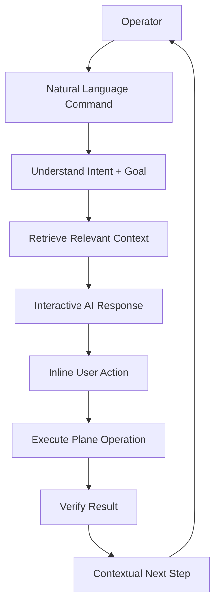
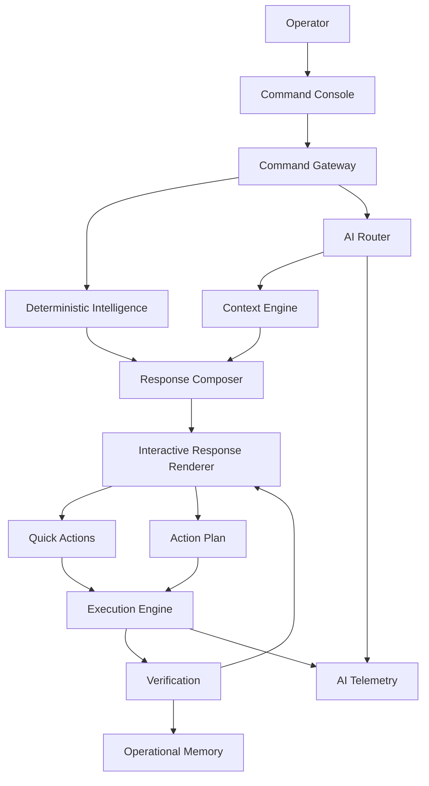

# Erdavid Work OS — Mission Control Command Experience & Interactive AI Response

**Product:** Erdavid Work OS — Mission Control
**Route:** `/command`
**Document:** Full Implementation Plan
**Version:** 2.0
**Status:** Enhancement Specification
**Primary Focus:** Interactive AI Response, Operational UX, Agentic Command Experience
**AI Provider:** Gemini 2.5 Flash-Lite + Gemini 2.5 Flash
**Primary Constraint:** Gemini Free Tier / Token Efficiency

---

# 1. Executive Summary

The current `/command` page already has the foundation of a sophisticated AI command center:

* Natural-language commands
* Indonesian + English understanding
* Mission Control visual language
* System Analysis responses
* Action Plans
* Human-in-the-loop approval
* Action Result Cards
* Vision Triage
* Session persistence
* AI telemetry
* Plane API execution

The next enhancement is to transform `/command` from:

```text
AI Chat Interface
```

into:

```text
AI Operational Command Center
```

The user should not have to repeatedly:

```text
Ask AI
→ read response
→ manually find task
→ manually navigate
→ manually perform action
→ return to chat
→ ask AI again
```

Instead:

```text
Ask
 ↓
AI understands
 ↓
AI shows relevant information
 ↓
User interacts directly with response
 ↓
Action
 ↓
Verification
 ↓
Next recommended action
```

The core UX principle:

> **The AI response should become an interactive workspace, not merely a message.**

---

# 2. Product Vision

The `/command` experience should feel like:

```text
Mission Control
+
Terminal
+
Project Copilot
+
Operational Dashboard
+
AI Agent Interface
```

Not:

```text
ChatGPT clone
```

The user should be able to manage most daily work without leaving `/command`.

---

# 3. Core Experience

The new interaction loop:



---

# 4. Design Principle

Every AI response should answer three questions:

```text
1. What did the system find?
2. What does it mean?
3. What can I do next?
```

Example:

```text
SYSTEM ANALYSIS

BSJ Phase 4 currently has:

● 7 overdue tasks
● 4 blocked tasks
● 3 high-priority tasks
● Cycle ends in 3 days

HEALTH
73 / 100

Primary concern:
2 blocked payment dependencies are affecting
3 downstream tasks.

RECOMMENDED NEXT ACTION

Prioritize BSJ7-124.

[Open Task]
[Assign]
[Move to In Progress]
[Show Dependencies]
```

This is substantially more useful than:

```text
There are 7 overdue tasks...
```

---

# 5. Response Architecture v2

Expand the current response types.

Current:

```text
System Analysis
Action Plan
Action Result
Vision Triage
```

New:

```text
1. System Analysis
2. Work Item List
3. Project Health
4. Recommendation
5. Action Plan
6. Action Result
7. Batch Operation
8. Decision / Clarification
9. Comparison
10. Timeline
11. Dependency Graph
12. Daily Mission
13. Alert
14. Vision Triage
15. Agent Progress
16. Empty / Recovery State
```

---

# 6. Response Envelope

All AI responses should use a unified response schema.

```typescript
interface CommandResponse {
  id: string

  type:
    | "analysis"
    | "work_items"
    | "project_health"
    | "recommendation"
    | "action_plan"
    | "action_result"
    | "batch_operation"
    | "clarification"
    | "comparison"
    | "timeline"
    | "dependency_graph"
    | "daily_mission"
    | "alert"
    | "vision_triage"
    | "agent_progress"
    | "error"

  title?: string

  summary?: string

  data?: unknown

  actions?: CommandAction[]

  evidence?: Evidence[]

  confidence?: number

  metadata?: ResponseMetadata
}
```

This allows the frontend to render responses based on type rather than relying entirely on Markdown.

---

# 7. Interactive Response Philosophy

Markdown remains supported.

However:

```text
Markdown
    ↓
for human-readable explanation
```

while:

```text
Structured Response
    ↓
for interactive UI
```

Example:

```json
{
  "type": "work_items",
  "summary": "4 tasks ditemukan",
  "data": {
    "items": [...]
  },
  "actions": [
    {
      "type": "open_issue",
      "target": "BSJ7-31"
    }
  ]
}
```

The UI renders the appropriate interactive card.

---

# 8. Response Composer

Create:

```text
src/components/ai/response/
```

Structure:

```text
response/
├── ResponseRenderer.tsx
├── AnalysisResponse.tsx
├── WorkItemResponse.tsx
├── ProjectHealthResponse.tsx
├── RecommendationResponse.tsx
├── ActionPlanResponse.tsx
├── ActionResultResponse.tsx
├── BatchOperationResponse.tsx
├── ClarificationResponse.tsx
├── ComparisonResponse.tsx
├── TimelineResponse.tsx
├── DependencyGraphResponse.tsx
├── DailyMissionResponse.tsx
├── AlertResponse.tsx
├── VisionTriageResponse.tsx
├── AgentProgressResponse.tsx
└── ErrorResponse.tsx
```

---

# 9. Response Renderer

```tsx
<ResponseRenderer response={response} />
```

Internally:

```text
analysis
    → AnalysisResponse

work_items
    → WorkItemResponse

project_health
    → ProjectHealthResponse

action_plan
    → ActionPlanResponse

dependency_graph
    → DependencyGraphResponse
```

This makes the architecture extensible.

---

# 10. Work Item Response

When user asks:

```text
Tampilkan task urgent aku
```

Do not return only text.

Render:

```text
┌─────────────────────────────────────────────┐
│ WORK QUEUE                                  │
│ 5 HIGH PRIORITY TASKS                       │
├─────────────────────────────────────────────┤
│                                             │
│ BSJ7-124                                    │
│ Implement bank account verification         │
│                                             │
│ P1   IN PROGRESS   DUE TODAY                │
│                                             │
│ [Open] [Complete] [Assign] [More]           │
│                                             │
├─────────────────────────────────────────────┤
│ BSJ7-131                                    │
│ Fix payout webhook                          │
│                                             │
│ P1   BLOCKED                                 │
│                                             │
│ [Open] [Resolve Blocker] [More]              │
└─────────────────────────────────────────────┘
```

All buttons except operations requiring reasoning should be deterministic.

---

# 11. Work Item Quick Actions

Every task card can expose:

```text
Open
Edit
Assign
Change Status
Change Priority
Add Label
Add Comment
Move Cycle
Show Dependencies
Mark Complete
```

Important:

These actions should directly use application APIs.

They should **not call Gemini again**.

---

# 12. Quick Action Architecture

```text
User clicks:

[Move to Done]

        ↓

Frontend
        ↓

POST /api/issues/:id/state
        ↓

Plane API
        ↓

Verification
        ↓

UI Update
```

No LLM call required.

---

# 13. Smart Actions

Some actions require reasoning.

Example:

```text
[Optimize]
```

Clicking it may invoke:

```text
AI
 ↓
Analyze task
 ↓
Recommend priority
 ↓
Recommend assignee
 ↓
Recommend deadline
```

These are explicitly AI-powered.

This distinction protects token usage.

---

# 14. Contextual Action Bar

Every major response can expose a contextual action bar.

Example:

```text
What would you like to do?

[Create Tasks]
[Prioritize]
[Show Blockers]
[Analyze Risk]
[Open Project]
```

Buttons should map to predefined intents.

---

# 15. Dynamic Suggested Actions

AI should generate structured suggested actions.

Example:

```json
{
  "actions": [
    {
      "label": "Show blockers",
      "intent": "list_blockers",
      "requiresAI": false
    },
    {
      "label": "Analyze deadline risk",
      "intent": "analyze_deadline_risk",
      "requiresAI": true
    }
  ]
}
```

This is important for token efficiency.

---

# 16. `requiresAI` Flag

Every action should explicitly declare:

```typescript
requiresAI: boolean
```

Example:

```text
Open Task
→ false

Assign Task
→ false

Show Dependencies
→ false

Analyze Risk
→ true

Generate Plan
→ true
```

---

# 17. Follow-Up Intelligence

After executing an operation, the system should understand what happened.

Example:

```text
User:
Pindahkan BSJ7-124 ke Done

AI:
BSJ7-124 berhasil dipindahkan ke Done.

VERIFIED

Next suggested action:
BSJ7-128 is now unblocked.

[Open BSJ7-128]
[Show Related Tasks]
```

The follow-up insight can often be calculated deterministically.

No new Gemini call required.

---

# 18. Action Result v2

Current result:

```text
Task created successfully.
```

New result:

```text
┌─────────────────────────────────────────────┐
│ ✓ OPERATION VERIFIED                       │
├─────────────────────────────────────────────┤
│ Created 4 work items                        │
│                                             │
│ ✓ BSJ7-201  Payment API                     │
│ ✓ BSJ7-202  Webhook Handler                 │
│ ✓ BSJ7-203  Frontend Integration            │
│ ✓ BSJ7-204  E2E Tests                       │
│                                             │
│ Project: BSJ Phase 4                        │
│                                             │
│ [Open Board] [Open Tasks] [Undo*]           │
└─────────────────────────────────────────────┘
```

`Undo` should only appear when a safe inverse operation exists.

---

# 19. Batch Operation UI

For batch actions:

```text
EXECUTION

4 / 6 COMPLETED

✓ Create API task
✓ Create webhook task
✓ Create frontend task
✓ Create testing task

● Updating dependencies
○ Verification
```

The progress state should come from actual backend events.

Do not fake progress.

---

# 20. Streaming Architecture

The AI response should stream meaningful stages.

Instead of:

```text
Loading...
```

use:

```text
● INTERPRETING COMMAND

● RESOLVING PROJECT

● RETRIEVING WORK ITEMS

● ANALYZING

○ GENERATING RESPONSE
```

However, these stages must represent actual backend states.

Do not expose hidden chain-of-thought.

Only expose high-level operational status.

---

# 21. Safe Agent Progress

Allowed:

```text
Analyzing workspace context
Resolving requested project
Checking task dependencies
Preparing operation
Waiting for approval
Executing operation
Verifying result
```

Do not display:

```text
private chain-of-thought
hidden reasoning
internal model deliberation
```

---

# 22. Agent Progress Component

Create:

```text
AgentProgressResponse.tsx
```

Visual:

```text
┌──────────────────────────────────────────────┐
│ MISSION PROCESS                              │
│                                              │
│ ✓ ANALYZE                                    │
│ ✓ CONTEXT                                    │
│ ✓ PLAN                                       │
│ ● REVIEW                                     │
│ ○ EXECUTE                                    │
│ ○ VERIFY                                     │
│                                              │
│ Awaiting operator approval                   │
└──────────────────────────────────────────────┘
```

---

# 23. Thinking State

Avoid generic:

```text
AI is thinking...
```

Use context-aware states:

```text
INTERPRETING
RETRIEVING
ANALYZING
PLANNING
WAITING
EXECUTING
VERIFYING
COMPLETED
```

---

# 24. Clarification Response

One major improvement should be reducing incorrect AI assumptions.

Example:

```text
Move payment task to Done.
```

If multiple tasks match:

```text
┌─────────────────────────────────────────────┐
│ CLARIFICATION REQUIRED                     │
├─────────────────────────────────────────────┤
│ I found 3 matching tasks:                  │
│                                             │
│ ○ BSJ7-124 Payment Gateway                  │
│ ○ BSJ7-137 Payment Confirmation             │
│ ○ BSJ7-145 Payment Webhook                  │
│                                             │
│ [Cancel]                                    │
└─────────────────────────────────────────────┘
```

Selecting an option should require:

```text
Gemini calls = 0
```

---

# 25. Ambiguity Handling

The AI must never silently guess when confidence is low.

Threshold:

```text
> 0.90
→ auto resolve

0.70–0.90
→ show candidates

< 0.70
→ clarification
```

Thresholds should be configurable and evaluated against real data.

---

# 26. Interactive Project Health

Instead of:

```text
Project health: 73
```

render:

```text
┌─────────────────────────────────────────────┐
│ PROJECT HEALTH                              │
│ BSJ PHASE 4                                 │
│                                             │
│             73 / 100                        │
│             HEALTHY                        │
│                                             │
│ Velocity       ███████░░░  72              │
│ Completion     ████████░░  81              │
│ Blockers       █████░░░░░  50              │
│ Deadline       ██████░░░░  61              │
│                                             │
│ PRIMARY RISK                                │
│ Payment integration is blocked.             │
│                                             │
│ [Show Risks] [Show Blockers] [Analyze]       │
└─────────────────────────────────────────────┘
```

---

# 27. Health Drill-Down

Click:

```text
[Show Risks]
```

should expand inline:

```text
RISK RADAR

HIGH
● Payment webhook dependency
● 3 overdue P1 tasks

MEDIUM
● Frontend workload imbalance
● QA capacity declining
```

No page navigation required.

---

# 28. Project Health → Action

From the health card:

```text
[Fix Highest Risk]
```

can create:

```text
AI Action Plan
```

This is a natural transition from information → action.

---

# 29. Recommendation Response

Example:

```text
┌─────────────────────────────────────────────┐
│ ✦ RECOMMENDATION                            │
├─────────────────────────────────────────────┤
│ Focus on BSJ7-124 today.                    │
│                                             │
│ Why:                                        │
│ • P1 priority                               │
│ • 2 days overdue                            │
│ • Blocks 3 downstream tasks                 │
│ • Cycle ends in 3 days                      │
│                                             │
│ IMPACT                                      │
│ High                                        │
│                                             │
│ [Open Task] [Create Plan] [Dismiss]         │
└─────────────────────────────────────────────┘
```

---

# 30. Evidence Drawer

Every AI recommendation should optionally expose:

```text
[Why?]
```

Click:

```text
Evidence

• Priority: P1
• Due date: Aug 21
• Blocked dependents: 3
• Cycle remaining: 3 days
• Last activity: 18 hours ago
```

This improves trust.

---

# 31. Token Optimization

The `Why?` interaction should not necessarily invoke Gemini.

The evidence is already stored as structured data.

Therefore:

```text
Click [Why?]
→ frontend expands evidence
→ Gemini = 0
```

---

# 32. Inline Task Preview

When AI references:

```text
BSJ7-124
```

the identifier should become interactive.

Click:

```text
BSJ7-124
```

opens:

```text
Issue Preview Drawer
```

without leaving `/command`.

---

# 33. Issue Preview Drawer

Display:

```text
Title
Description
Status
Priority
Assignee
Cycle
Labels
Due date
Dependencies
Activity
```

Actions:

```text
Edit
Assign
Move
Comment
Complete
Open Full Page
```

---

# 34. Entity Mentions

The AI response renderer should recognize:

```text
BSJ7-124
@David
BSJ Phase 4
Cycle 12
```

and transform them into interactive entities.

Architecture:

```text
AI Structured Response
 ↓
Entity Resolver
 ↓
Interactive Mention
```

---

# 35. Entity Hover Preview

Desktop:

```text
Hover BSJ7-124
```

shows:

```text
BSJ7-124
Payment Gateway

P1
In Progress
David Putra

Due today
```

No AI request.

---

# 36. Smart Command Chips

Initial page:

```text
WHAT DO YOU WANT TO ACCOMPLISH?

[Plan my day]
[Show urgent tasks]
[Check project health]
[Find blockers]
```

These are dynamically generated from current workspace state.

The content should come from deterministic analytics whenever possible.

---

# 37. Context-Aware Starters

If user has overdue tasks:

```text
⚠ 7 overdue tasks
[Review overdue work]
```

If cycle ends soon:

```text
◷ Cycle ends in 2 days
[Review cycle risk]
```

If no urgent tasks:

```text
✓ No critical overdue work
[Plan today's focus]
```

This makes the interface feel intelligent without consuming AI tokens.

---

# 38. Input Console v2

Current:

```text
Textarea
+
Send
```

Upgrade:

```text
┌─────────────────────────────────────────────┐
│ Ask Mission Control...                      │
│                                             │
│ /project /task /cycle /plan /analyze        │
│                                             │
│ 📎  ⌘K Commands                 Send ↵       │
└─────────────────────────────────────────────┘
```

---

# 39. Slash Commands

Add deterministic slash commands:

```text
/project
/task
/cycle
/member
/search
/today
/overdue
/blockers
/health
/plan
```

Example:

```text
/project BSJ
```

should resolve directly.

No Gemini required.

---

# 40. Command Autocomplete

Typing:

```text
/
```

opens:

```text
COMMANDS

/project
/task
/today
/overdue
/blockers
/health
/plan
/search
```

---

# 41. Keyboard Shortcuts

Recommended:

```text
⌘K / Ctrl+K
→ Command palette

Enter
→ Submit

Shift+Enter
→ New line

Esc
→ Close modal/drawer

⌘Enter / Ctrl+Enter
→ Execute approved plan

⌘Shift+P
→ Project switcher

⌘Shift+N
→ New operation
```

Avoid assigning `Ctrl+Enter` to dangerous execution without a clear approval state.

---

# 42. Command Palette

Create:

```text
CommandPalette.tsx
```

Example:

```text
┌──────────────────────────────────────────┐
│ Search commands...                       │
├──────────────────────────────────────────┤
│ Mission                                  │
│ → Plan my day                            │
│ → Review blockers                        │
│ → Analyze project                        │
│                                          │
│ Navigation                               │
│ → Open Board                             │
│ → Open Analytics                         │
│                                          │
│ Actions                                  │
│ → Create task                            │
│ → Start cycle                            │
└──────────────────────────────────────────┘
```

---

# 43. Project Switcher

The active project should be quickly switchable.

```text
⌘Shift+P
```

opens:

```text
PROJECTS

★ BSJ Phase 4
  Erdavid Work OS
  Marketing Platform
  Internal Tools
```

Switching project should update:

```text
Context
Quick prompts
Task retrieval
Health
Recommendations
```

No Gemini required.

---

# 44. Conversation Context Indicator

The UI should clearly display:

```text
ACTIVE CONTEXT

Workspace:
Erdavid

Project:
BSJ Phase 4

Cycle:
Sprint 12

Scope:
My Tasks
```

This reduces accidental commands against the wrong project.

---

# 45. Context Override

Allow:

```text
[BSJ Phase 4 ▾]
```

Options:

```text
Current Project
All Projects
Specific Project
My Tasks
Team
```

---

# 46. Scope Lock

When a mutation is requested, show:

```text
TARGET SCOPE

Project:
BSJ Phase 4

4 tasks affected
```

This prevents accidental cross-project mutations.

---

# 47. Bulk Selection

Responses containing tasks should support:

```text
☐ BSJ7-124
☐ BSJ7-131
☐ BSJ7-144
☐ BSJ7-151
```

Then:

```text
4 selected

[Assign]
[Change Status]
[Change Priority]
[Move Cycle]
```

These operations should be executed directly when deterministic.

---

# 48. Natural Language + Selection

Example:

```text
User:
Tampilkan task overdue.
```

AI returns list.

User selects:

```text
☑ BSJ7-124
☑ BSJ7-131
☑ BSJ7-144
```

Then clicks:

```text
[Assign]
```

This should open a deterministic member selector.

No additional AI required.

---

# 49. Smart Batch Plan

For complex selection:

```text
Select 4 tasks

[Optimize these tasks]
```

AI can analyze:

```text
priority
dependency
assignee
deadline
```

and produce:

```text
Recommended batch plan
```

One Gemini request for the entire batch.

---

# 50. Undo Architecture

Where possible, every mutation should create:

```typescript
interface OperationReceipt {
  operationId: string
  inverseOperation?: Action
}
```

Example:

```text
Move BSJ7-124 → Done

[Undo]
```

Undo should call the inverse deterministic API.

No Gemini.

---

# 51. Action Receipts

Every operation produces:

```text
OPERATION RECEIPT

ID:
OP-2026-0821-0012

Status:
VERIFIED

Affected:
4 work items

Duration:
1.8s

AI Calls:
0
```

This is particularly useful in a Mission Control interface.

---

# 52. AI Usage Visibility

Show subtle telemetry:

```text
ENGINE

ROUTE
DETERMINISTIC

AI
NOT REQUIRED

Latency
184ms
```

For AI:

```text
ENGINE

ROUTE
FLASH-LITE

Tokens
1,204

Latency
782ms
```

Do not make telemetry dominate the UX.

---

# 53. User-Friendly AI Usage

Avoid:

```text
Token consumption: 1,204
```

for every message.

Instead:

```text
FAST ROUTE
```

and allow:

```text
[View Diagnostics]
```

for detailed telemetry.

---

# 54. Response Density Modes

Add:

```text
Compact
Comfortable
Detailed
```

### Compact

For experienced users.

```text
BSJ7-124 — P1 — Blocked
[Open] [Fix]
```

### Comfortable

Default.

### Detailed

Shows evidence, metadata, reasoning summary, and dependencies.

---

# 55. Response Collapse

Long responses should collapse secondary details.

Example:

```text
Project Health
73 / 100

Primary Risk:
Payment integration blocked.

[Show 7 more insights]
```

This prevents chat flooding.

---

# 56. Persistent Important Responses

Allow:

```text
[Pin to Mission Log]
```

Pinned items:

```text
Today's Focus
Project Risk
Important Recommendation
Active Plan
```

---

# 57. Mission Log

The left column should evolve from simple session history into:

```text
MISSION LOG
```

Sections:

```text
ACTIVE
RECENT
PINNED
COMPLETED
```

Each operation displays:

```text
Status
Timestamp
Project
Operation type
```

---

# 58. Mission Status

Use:

```text
● ACTIVE
✓ COMPLETED
⚠ NEEDS REVIEW
✕ FAILED
◷ WAITING
```

---

# 59. Resume Operation

If an agent run is interrupted:

```text
MISSION PAUSED

"Prepare BSJ release"

Progress:
4 / 6 steps

[Resume]
[Cancel]
```

Resume must use persisted `agent_run_id`.

---

# 60. Daily Mission Mode

Add a dedicated response:

```text
DAILY MISSION
```

Example:

```text
┌─────────────────────────────────────────────┐
│ TODAY'S MISSION                             │
│ Friday, 21 August                           │
├─────────────────────────────────────────────┤
│                                             │
│ PRIMARY FOCUS                               │
│ BSJ7-124                                    │
│ Payment Gateway Integration                 │
│                                             │
│ WHY                                         │
│ P1 • Overdue • Blocks 3 tasks               │
│                                             │
│ SECONDARY                                   │
│ 2. BSJ7-131                                 │
│ 3. BSJ7-144                                 │
│                                             │
│ RISKS                                       │
│ 2 blocked dependencies                      │
│                                             │
│ [Start Focus Mode]                          │
└─────────────────────────────────────────────┘
```

---

# 61. Focus Mode

When clicking:

```text
[Start Focus Mode]
```

the UI switches into:

```text
FOCUS MODE

BSJ7-124

P1
Payment Gateway Integration

NEXT:
Implement bank verification callback.

[Open Task]

────────────────

Related:
BSJ7-128
BSJ7-131
```

This creates a distraction-free working mode.

---

# 62. Focus Mode Actions

```text
Complete
Pause
Block
Add Note
Open Dependencies
Exit Focus
```

---

# 63. AI Focus Assistance

Optional:

```text
[What should I do next?]
```

This may call Gemini.

But normal navigation does not.

---

# 64. Dependency Graph Response

When user asks:

```text
Apa yang nge-block payment gateway?
```

render:

```text
PAYMENT RELEASE CHAIN

Bank Account Verification
        │
        ▼
Payment API
        │
        ▼
Webhook Handler
        │
        ▼
Transaction Confirmation
        │
        ▼
E2E Testing
        │
        ▼
Release
```

Interactive nodes:

```text
[BSJ7-124]
```

Click opens issue preview.

---

# 65. Dependency Actions

Graph footer:

```text
[Open Blocker]
[Show Critical Path]
[Create Resolution Plan]
```

`Open Blocker` is deterministic.

`Show Critical Path` can be deterministic if graph algorithms are available.

`Create Resolution Plan` requires AI.

---

# 66. Comparison Response

User:

```text
Mana yang harus dikerjakan dulu, BSJ7-124 atau BSJ7-131?
```

Render:

```text
PRIORITY COMPARISON

              BSJ7-124       BSJ7-131

Priority      P1             P2
Due           Today          Tomorrow
Blocked       3 tasks        0
Cycle Risk    HIGH            LOW

RECOMMENDATION

BSJ7-124

Confidence:
HIGH

[Open BSJ7-124]
[Create Plan]
```

The comparison metrics are deterministic.

Gemini only generates the final explanation if necessary.

---

# 67. Clarification Chips

Instead of requiring typing:

```text
Which project?
```

show:

```text
I found multiple matching projects.

[BSJ Phase 4]
[BSJ Phase 3]
[BSJ Core]
```

Selecting a chip resolves the ambiguity.

---

# 68. Smart Follow-Up Suggestions

After a response:

```text
Suggested next actions:

[Show blockers]
[Plan today's work]
[Review overdue tasks]
```

These should be generated from structured context.

No LLM call required.

---

# 69. Conversation Memory UX

The AI should show when it is using session context.

Example:

```text
CONTEXT ACTIVE

You're currently discussing:
BSJ Phase 4
Payment Integration
```

This avoids confusion.

---

# 70. Context Reset

Add:

```text
[Reset Context]
```

When clicked:

```text
Current project context cleared.

Workspace:
All Projects
```

No AI call.

---

# 71. Vision Response v2

Current Vision:

```text
Screenshot
→ Bug analysis
→ Action Plan
```

Upgrade:

```text
Screenshot
 ↓
Visual analysis
 ↓
Detected elements
 ↓
Potential issue
 ↓
Evidence
 ↓
Suggested severity
 ↓
Duplicate search
 ↓
Action Plan
```

---

# 72. Vision Result UI

```text
VISION TRIAGE

Screenshot analyzed.

DETECTED

Component:
Payment Modal

Issue:
Submit button remains disabled
after valid bank selection.

SEVERITY
HIGH

EVIDENCE
• Button state unchanged
• Validation appears successful
• Modal remains open

POSSIBLE DUPLICATE
BSJ7-112 — 78% similarity

[Open Existing]
[Create New Bug]
[Ignore]
```

---

# 73. Vision Token Optimization

Before Gemini:

```text
Image preprocessing
```

If screenshot dimensions are excessive:

```text
Resize
Compress
```

If the user asks only:

```text
Apa errornya?
```

do not request:

```text
full UI redesign analysis
```

Use task-specific Vision prompts.

---

# 74. Rich Markdown

Continue supporting:

```text
headings
bold
italic
lists
tables
code blocks
inline code
links
```

But add:

```text
interactive entities
interactive buttons
structured cards
collapsible sections
```

---

# 75. Code Block UX

For technical responses:

```text
┌─────────────────────────────────────┐
│ TypeScript                    Copy  │
├─────────────────────────────────────┤
│ const result = await ...            │
└─────────────────────────────────────┘
```

Copy must be frontend-only.

No AI request.

---

# 76. Table UX

Tables should support:

```text
horizontal scroll
column priority
responsive collapse
row actions
```

For mobile, transform rows into cards where necessary.

---

# 77. Link Safety

AI-generated links should be validated.

For internal issue links:

```text
BSJ7-124
```

prefer internal routing:

```text
/command?issue=...
```

or drawer state.

External links should be explicitly marked.

---

# 78. Error Response v2

Do not show:

```text
Something went wrong.
```

Instead:

```text
┌─────────────────────────────────────────────┐
│ ⚠ OPERATION INTERRUPTED                    │
├─────────────────────────────────────────────┤
│ Plane API did not respond in time.          │
│                                             │
│ No data was changed.                        │
│                                             │
│ Operation:
│ Move BSJ7-124 → Done                        │
│                                             │
│ [Retry] [View Task]                         │
└─────────────────────────────────────────────┘
```

---

# 79. AI Quota Error

If Gemini quota is exhausted:

```text
┌─────────────────────────────────────────────┐
│ AI REASONING TEMPORARILY UNAVAILABLE       │
├─────────────────────────────────────────────┤
│ Advanced reasoning has reached its current  │
│ usage limit.                                │
│                                             │
│ Standard workspace operations remain        │
│ available.                                  │
│                                             │
│ Available now:                              │
│ [View Tasks] [Search] [Update] [Analytics] │
└─────────────────────────────────────────────┘
```

Do not make the entire `/command` page unusable.

---

# 80. Token-Safe Interaction Matrix

| Interaction                     | Gemini |
| ------------------------------- | -----: |
| Open issue                      |      0 |
| Open project                    |      0 |
| Change status                   |      0 |
| Assign task                     |      0 |
| Change priority                 |      0 |
| Show dependencies               |      0 |
| Filter tasks                    |      0 |
| Sort tasks                      |      0 |
| Expand evidence                 |      0 |
| Open task preview               |      0 |
| Select project                  |      0 |
| Command palette                 |      0 |
| Undo                            |      0 |
| List tasks                      |      0 |
| Basic analytics                 |      0 |
| Natural language classification |   Lite |
| Simple summary                  |   Lite |
| Risk explanation                |  Flash |
| Feature decomposition           |  Flash |
| Complex planning                |  Flash |
| Vision analysis                 |  Flash |
| Agent reasoning                 |  Flash |

---

# 81. Response Token Optimization

AI should not generate:

```text
10 paragraphs
```

when:

```text
1 sentence
+
interactive card
```

is sufficient.

Default response policy:

```text
Summary:
1–3 sentences

Structured data:
Interactive UI

Explanation:
Collapsed

Actions:
Visible
```

---

# 82. Adaptive Response Length

User asks:

```text
apa task urgent?
```

Response:

```text
3 urgent tasks ditemukan.

[Task Cards]
```

User asks:

```text
kenapa BSJ lagi bermasalah?
```

Response:

```text
Detailed analysis
+
evidence
+
recommendations
```

The response format should match intent.

---

# 83. Conversation Continuity

Example:

```text
User:
Apa task paling penting hari ini?

AI:
BSJ7-124.

User:
Kenapa?

AI:
Karena task tersebut P1...
```

The second request should use session context.

No need to resend the entire workspace.

---

# 84. Context Compression

Conversation history must not grow indefinitely.

Use:

```text
Recent messages
+
Session summary
+
Relevant entities
+
Relevant decisions
```

Instead of:

```text
Entire conversation history
```

---

# 85. Session Summary

After sufficient conversation:

```json
{
  "topic": "BSJ Payment Integration",
  "activeProject": "BSJ Phase 4",
  "activeIssues": [
    "BSJ7-124",
    "BSJ7-131"
  ],
  "decisions": [],
  "pendingActions": []
}
```

This dramatically reduces repeated context.

---

# 86. Conversation State Machine

```text
IDLE
 ↓
INPUT
 ↓
PROCESSING
 ↓
RESPONDING
 ↓
WAITING_FOR_USER
 ↓
ACTION
 ↓
VERIFYING
 ↓
COMPLETED
```

Possible branch:

```text
PROCESSING
 ↓
CLARIFICATION_REQUIRED
```

---

# 87. Frontend State

Recommended Zustand store:

```typescript
interface CommandState {
  sessionId: string

  activeProjectId?: string

  activeScope: Scope

  messages: CommandMessage[]

  activePlan?: ActionPlan

  activeAgentRun?: AgentRun

  selectedIssues: string[]

  responseDensity: "compact" | "comfortable" | "detailed"

  isProcessing: boolean

  processingStage?: ProcessingStage
}
```

---

# 88. Server State

Use TanStack Query for:

```text
projects
issues
members
cycles
analytics
health
risks
agent runs
```

Use Zustand for:

```text
chat UI state
selection
drawer
modal
active operation
input
keyboard state
```

---

# 89. Optimistic UI

For safe deterministic operations:

```text
Change priority
Assign
Move state
```

Use optimistic update.

Flow:

```text
Click
 ↓
Optimistic UI
 ↓
API
 ↓
Verify
 ↓
Confirm / Rollback
```

No AI.

---

# 90. Animation System

Use `motion/react`.

Animations:

```text
message enter
card expand
drawer open
agent step transition
status change
batch progress
notification
```

Avoid excessive animation.

Mission Control should feel:

```text
precise
technical
responsive
```

not:

```text
playful
bouncy
chatbot-like
```

---

# 91. Agent Step Animation

Example:

```text
✓ ANALYZE
      ↓
✓ CONTEXT
      ↓
● PLAN
      ↓
○ REVIEW
      ↓
○ EXECUTE
```

Animate only transitions between actual server states.

---

# 92. Auto-Scroll

Chat should auto-scroll only when:

```text
user is already near bottom
```

If user has scrolled upward:

```text
3 new messages
```

show:

```text
↓ New activity
```

Do not forcibly scroll.

---

# 93. Response Actions Persistence

Actions should remain usable after scrolling.

For long responses:

```text
Sticky Action Bar
```

Example:

```text
─────────────────────────────
4 tasks selected

[Assign] [Move] [Priority]
─────────────────────────────
```

---

# 94. Mobile Experience

Three-column desktop becomes:

```text
Mobile

Command
 ↓
Context Drawer
 ↓
Mission Log Drawer
```

Top:

```text
[☰] Mission Control [Context]
```

---

# 95. Mobile Response Cards

Cards should become:

```text
full-width
touch-friendly
```

Minimum interactive target:

```text
44px+
```

---

# 96. Mobile Input

Bottom command console:

```text
┌─────────────────────────────┐
│ Ask Mission Control...      │
│ 📎                   Send → │
└─────────────────────────────┘
```

Should remain accessible while scrolling.

---

# 97. Accessibility

Implement:

```text
keyboard navigation
focus management
ARIA labels
screen reader descriptions
visible focus states
reduced motion
```

---

# 98. Response Component Registry

Create:

```typescript
const responseRegistry = {
  analysis: AnalysisResponse,
  work_items: WorkItemResponse,
  project_health: ProjectHealthResponse,
  recommendation: RecommendationResponse,
  action_plan: ActionPlanResponse,
  action_result: ActionResultResponse,
  batch_operation: BatchOperationResponse,
  clarification: ClarificationResponse,
  comparison: ComparisonResponse,
  timeline: TimelineResponse,
  dependency_graph: DependencyGraphResponse,
  daily_mission: DailyMissionResponse,
  alert: AlertResponse,
  vision_triage: VisionTriageResponse,
  agent_progress: AgentProgressResponse,
  error: ErrorResponse
}
```

---

# 99. Backend Response Builder

Create:

```text
src/application/ai/response/
```

```text
ResponseBuilder
ResponsePolicy
ActionBuilder
EvidenceBuilder
EntityReferenceBuilder
```

Responsibilities:

```text
intent
+
structured data
+
context
+
permissions
```

→

```text
CommandResponse
```

---

# 100. Action Policy

The backend should decide which actions are allowed.

Example:

```typescript
{
  type: "update_issue",
  target: "BSJ7-124",
  label: "Move to Done",
  requiresApproval: false,
  requiresAI: false
}
```

For risky operations:

```typescript
{
  type: "bulk_update",
  requiresApproval: true
}
```

---

# 101. Permission-Aware UI

The AI must not show actions the user cannot execute.

If user cannot delete:

```text
Delete
```

must not appear.

This is determined from authorization state, not AI.

---

# 102. Smart Empty States

If no task:

```text
NO ACTIVE TASKS

You currently have no active tasks in BSJ Phase 4.

Suggested:

[Review Completed]
[Check Team Workload]
[Plan Next Cycle]
```

---

# 103. Empty State Token Strategy

No AI required.

The frontend/backend knows:

```text
count = 0
```

Therefore:

```text
Gemini = 0
```

---

# 104. Loading States

Avoid:

```text
Skeleton everywhere
```

For deterministic operations:

```text
Fetching tasks...
```

For AI:

```text
INTERPRETING COMMAND
```

For mutation:

```text
EXECUTING OPERATION
```

---

# 105. Latency Strategy

Target:

```text
Deterministic:
< 300ms

Lite:
< 1.5s

Deep:
< 4s

Agent:
stream progress
```

These are UX targets, not guarantees.

---

# 106. Streaming

Use streaming where useful for:

```text
deep analysis
long response
agent progress
vision
```

Do not stream:

```text
simple CRUD
```

---

# 107. AI Request Deduplication

Prevent duplicate requests caused by:

```text
double click
retry
React rerender
network reconnect
```

Use:

```text
requestId
idempotencyKey
```

---

# 108. Frontend Request Guard

When sending:

```text
isSubmitting = true
```

Disable duplicate submission.

Server must still enforce idempotency.

---

# 109. Notification Integration

Important AI events can produce:

```text
Mission Alert
```

Examples:

```text
Project health dropped
Task became overdue
Critical dependency blocked
Agent needs approval
Agent completed
```

Avoid notification spam.

---

# 110. Alert Deduplication

Same risk should not notify repeatedly.

Use:

```text
risk_event_id
last_notified_at
notification_state
```

---

# 111. AI Proactivity Budget

Proactive AI should have its own quota.

Example:

```text
interactive_ai_budget
proactive_ai_budget
```

Never let background intelligence consume all user-facing quota.

---

# 112. Background AI

Background jobs should only execute when:

```text
meaningful state change
AND
budget available
AND
risk threshold met
```

Not:

```text
every 5 minutes
```

---

# 113. Smart Recompute

Project health:

```text
If no relevant changes:
use cache.
```

If:

```text
status changed
deadline changed
assignment changed
dependency changed
```

recompute.

---

# 114. Recommended UX Hierarchy

Every response should follow:

```text
1. Status
2. Summary
3. Evidence
4. Data
5. Recommendation
6. Actions
```

Example:

```text
STATUS
⚠ Needs Attention

SUMMARY
BSJ Phase 4 health dropped to 73.

EVIDENCE
3 overdue P1 tasks.

DATA
[Task Cards]

RECOMMENDATION
Prioritize BSJ7-124.

ACTIONS
[Open] [Plan] [Assign]
```

---

# 115. AI Response Persona

The system should feel:

```text
precise
operational
concise
confident
evidence-based
technical
```

Avoid:

```text
overly conversational
long introductions
repetitive apologies
unnecessary enthusiasm
generic filler
```

---

# 116. Example End-to-End Interaction

User:

```text
Apa yang harus aku kerjakan hari ini?
```

System:

```text
DAILY MISSION

3 priority tasks identified.

PRIMARY FOCUS

BSJ7-124
Payment Gateway Integration

P1
Overdue by 1 day
Blocks 3 tasks

SECONDARY

BSJ7-131
Webhook Retry Handling

P1
Due today

BSJ7-144
Transaction Mapper Tests

P2
Due tomorrow

[Start Focus]
[Show All]
[Analyze Risks]
```

Gemini:

```text
0 calls
```

because the prioritization can be calculated deterministically.

---

# 117. Second Interaction

User:

```text
Kenapa BSJ7-124 paling penting?
```

System:

```text
PRIORITY ANALYSIS

BSJ7-124 ranks highest because:

• P1 priority
• Overdue
• Blocks 3 downstream tasks
• Cycle ends in 3 days

IMPACT
HIGH

[Open Task]
[Show Dependencies]
[Create Resolution Plan]
```

Gemini may be used only if a natural-language explanation requires reasoning beyond structured evidence.

---

# 118. Third Interaction

User:

```text
Buatkan plan untuk menyelesaikannya.
```

System:

```text
PROPOSED MISSION PLAN

ANALYZE
✓ Existing task state

CONTEXT
✓ 3 dependent tasks

PLAN
1. Resolve bank verification
2. Complete payment callback
3. Validate webhook
4. Run integration tests

RISK
MEDIUM

EXPECTED IMPACT
Unblocks 3 tasks

[Edit Plan]
[Approve & Run]
```

Gemini:

```text
1 Flash call
```

---

# 119. Fourth Interaction

User clicks:

```text
Approve & Run
```

Backend:

```text
Execute
 ↓
Verify
```

Gemini:

```text
0 calls
```

---

# 120. Fifth Interaction

Result:

```text
✓ OPERATION VERIFIED

2 actions completed.

BSJ7-124
✓ Updated

BSJ7-128
✓ Unblocked

NEXT

BSJ7-128 is now ready.

[Open BSJ7-128]
[Start Focus]
```

Gemini:

```text
0 calls
```

---

# 121. Resulting Experience

One user goal:

```text
"Help me finish this task."
```

can become:

```text
Discover
 ↓
Understand
 ↓
Plan
 ↓
Approve
 ↓
Execute
 ↓
Verify
 ↓
Continue
```

without the user manually navigating across multiple pages.

---

# 122. Implementation Priority

## P0 — Critical

Implement first:

```text
Response schema
Response renderer
Interactive work item cards
Quick actions
Entity mentions
Issue preview drawer
Clarification UI
Context indicator
Action result verification
```

---

## P1 — High

Then:

```text
Project health response
Recommendation response
Evidence drawer
Dependency graph
Batch operations
Command palette
Slash commands
Dynamic suggested actions
```

---

## P2 — Advanced

Then:

```text
Daily Mission
Focus Mode
Agent progress
Mission resume
Persistent operation receipts
Proactive alerts
```

---

## P3 — Future

Later:

```text
multi-agent workflows
advanced predictive intelligence
cross-project planning
release management agent
QA agent
documentation agent
```

---

# 123. Implementation File Changes

## Frontend

Modify:

```text
src/components/ai/ChatInterface.tsx
src/components/ai/ActionCard.tsx
src/components/ai/ActionPlanCard.tsx
```

Add:

```text
src/components/ai/response/
src/components/ai/entities/
src/components/ai/command/
src/components/ai/mission/
src/components/ai/focus/
src/components/ai/context/
```

---

# 124. Suggested Components

```text
ResponseRenderer
AnalysisResponse
WorkItemResponse
ProjectHealthResponse
RecommendationResponse
ClarificationResponse
ComparisonResponse
DependencyGraphResponse
DailyMissionResponse
AgentProgressResponse
ActionResultResponse

IssueMention
ProjectMention
MemberMention
EntityPreview

IssuePreviewDrawer
ProjectContextSwitcher
CommandPalette
SlashCommandMenu
QuickActionBar
EvidenceDrawer
MissionProgress
MissionLog
FocusMode
```

---

# 125. Backend Changes

Modify:

```text
/api/ai/plan
/api/ai/execute
/api/ai/sessions
```

Add:

```text
/api/ai/respond
/api/ai/verify
/api/ai/clarify
/api/ai/recommendations
/api/ai/risks
/api/ai/agent-runs
```

Some can be merged depending on the existing API architecture.

Do not create endpoints unnecessarily if existing service boundaries already provide the capability.

---

# 126. Service Layer

Add:

```text
CommandResponseService
ResponseActionService
EntityReferenceService
RecommendationService
MissionService
AgentProgressService
OperationReceiptService
```

---

# 127. Testing Matrix

## Response Rendering

Test every:

```text
response.type
```

---

## Quick Actions

Test:

```text
open
assign
status
priority
cycle
comment
```

---

## AI Calls

Assert:

```text
deterministic action
→ Gemini = 0
```

---

## Complex Reasoning

Assert:

```text
decomposition
→ Flash
```

---

## Ambiguity

Assert:

```text
multiple entities
→ clarification
```

---

## Verification

Assert:

```text
API success
+
database state
=
verified
```

---

# 128. Token Testing

Example:

```text
Scenario:
Open issue preview

Expected Gemini:
0

Scenario:
Move issue to Done

Expected Gemini:
0

Scenario:
Show dependencies

Expected Gemini:
0

Scenario:
Analyze risk

Expected:
1 Lite/Flash request depending on complexity

Scenario:
Create feature decomposition

Expected:
1 Flash request
```

---

# 129. UX Success Metrics

Track:

```text
Task completion time
Commands per completed task
Page navigations per task
AI calls per operation
User correction rate
Action plan approval rate
Action failure rate
Clarification rate
Response interaction rate
```

---

# 130. Key Product Metric

Add:

```text
Command-to-Completion Efficiency
```

Formula:

```text
successful_operations
/
total_user_command_interactions
```

Goal:

```text
increase successful work completion
while reducing navigation and AI calls
```

---

# 131. AI Efficiency Metric

Track:

```text
Gemini Calls / Completed Operation
```

Example:

```text
Before:
2.8 calls / operation

Target:
< 0.8 calls / operation
```

---

# 132. User Efficiency Metric

Track:

```text
Average clicks to complete task
```

Example:

```text
Before:
Open board
→ find task
→ open task
→ edit
→ save
→ return

6+ interactions

After:
Command
→ Action Card
→ Quick Action

2 interactions
```

---

# 133. Final `/command` Architecture



---

# 134. Final User Experience

The finished `/command` should behave like:

```text
                    MISSION CONTROL

 ┌──────────────┬─────────────────────────┬──────────────┐
 │              │                         │              │
 │ MISSION LOG  │    COMMAND TERMINAL     │   CONTEXT    │
 │              │                         │              │
 │ Active       │  User                  │ Project      │
 │ Recent       │  "What should I do?"   │ BSJ Phase 4  │
 │ Pinned       │                         │              │
 │              │  ┌───────────────────┐  │ Health 73    │
 │ ✓ Completed  │  │ DAILY MISSION     │  │              │
 │ ⚠ Review     │  │                   │  │ 7 Overdue   │
 │              │  │ Focus: BSJ7-124   │  │ 4 Blocked   │
 │              │  │                   │  │              │
 │              │  │ [Start Focus]    │  │ Risks 2      │
 │              │  └───────────────────┘  │              │
 │              │                         │              │
 │              │  ┌───────────────────┐  │ Engine       │
 │              │  │ RECOMMENDATION    │  │              │
 │              │  │ Fix payment flow  │  │ Deterministic│
 │              │  │                   │  │              │
 │              │  │ [Plan] [Open]     │  │              │
 │              │  └───────────────────┘  │              │
 │              │                         │              │
 │              │ ┌─────────────────────┐ │              │
 │              │ │ Ask Mission Control  │ │              │
 │              │ └─────────────────────┘ │              │
 └──────────────┴─────────────────────────┴──────────────┘
```

---

# 135. Final Architecture Principle

The final `/command` experience should follow:

```text
CHAT
  ↓
COMMAND
  ↓
CONTEXT
  ↓
INTELLIGENCE
  ↓
INTERACTION
  ↓
ACTION
  ↓
VERIFICATION
  ↓
NEXT ACTION
```

Not:

```text
CHAT
 ↓
ANSWER
 ↓
END
```

---

# 136. Final Token Principle

Every UI interaction must first ask:

```text
Can this be solved by UI state?
        ↓
Can this be solved by application logic?
        ↓
Can this be solved by database/query?
        ↓
Can this be solved by cached intelligence?
        ↓
Can Flash-Lite solve it?
        ↓
Only then:
Use Flash.
```

Therefore:

> **Interactive does not mean AI-heavy.**

The interface can become dramatically more powerful while Gemini usage actually decreases.

---

# 137. Final Product Definition

Erdavid Work OS `/command` becomes:

> **An AI-powered operational command center where the user can understand work, interact with live project data, make decisions, execute actions, and verify results without leaving the command interface.**

The AI should not replace the workspace UI.

It should make the workspace UI:

```text
faster
smarter
more contextual
more actionable
less repetitive
```

while maintaining:

```text
human approval
application authorization
deterministic execution
verification
token efficiency
auditability
```

---

# 138. Final Implementation Order

```text
PHASE 1
Response Schema
        ↓
PHASE 2
Interactive Response Renderer
        ↓
PHASE 3
Entity Mentions + Issue Drawer
        ↓
PHASE 4
Quick Actions
        ↓
PHASE 5
Clarification System
        ↓
PHASE 6
Project Health + Recommendations
        ↓
PHASE 7
Evidence + Dependency Visualization
        ↓
PHASE 8
Command Palette + Slash Commands
        ↓
PHASE 9
Daily Mission + Focus Mode
        ↓
PHASE 10
Agent Progress + Resume
        ↓
PHASE 11
Proactive Intelligence
        ↓
PHASE 12
Advanced Multi-Agent Operations
```

---

# 139. Definition of Done

The `/command` enhancement is complete when:

```text
✓ AI responses are structured
✓ Markdown remains supported
✓ Work items are interactive
✓ Issue IDs are clickable
✓ Project names are interactive
✓ Members are interactive
✓ Quick actions work without AI
✓ Bulk actions work
✓ Ambiguous requests produce selectable clarification
✓ Action plans are editable
✓ Action plans have risk indicators
✓ Operations are verified
✓ Results contain operation receipts
✓ AI progress exposes safe operational stages
✓ No private chain-of-thought is exposed
✓ Daily Mission exists
✓ Focus Mode exists
✓ Project health is interactive
✓ Risks can be drilled down
✓ Evidence is visible
✓ Dependency relationships are interactive
✓ Command palette works
✓ Slash commands work
✓ Keyboard shortcuts work
✓ Mobile experience is supported
✓ AI quota exhaustion does not break core functionality
✓ Deterministic interactions consume 0 Gemini calls
✓ AI requests are deduplicated
✓ Conversation context is compressed
✓ Response caching exists
✓ AI telemetry records interaction cost
✓ User can complete common work without leaving /command
```

---

# 140. Final Target

The final experience should make the user think:

```text
"I don't need to open five different pages
just to figure out what I should do next."
```

The `/command` page becomes the **operational front door** of Erdavid Work OS.

The underlying Plane workspace remains the source of truth.

Gemini provides reasoning when reasoning is actually necessary.

The application itself handles:

```text
data
state
search
filtering
navigation
permissions
execution
verification
```

And the AI handles:

```text
understanding
reasoning
planning
recommendation
ambiguity resolution
complex analysis
```

This separation is what allows the interface to become significantly more intelligent without sacrificing reliability or exhausting the Gemini Free Tier.
