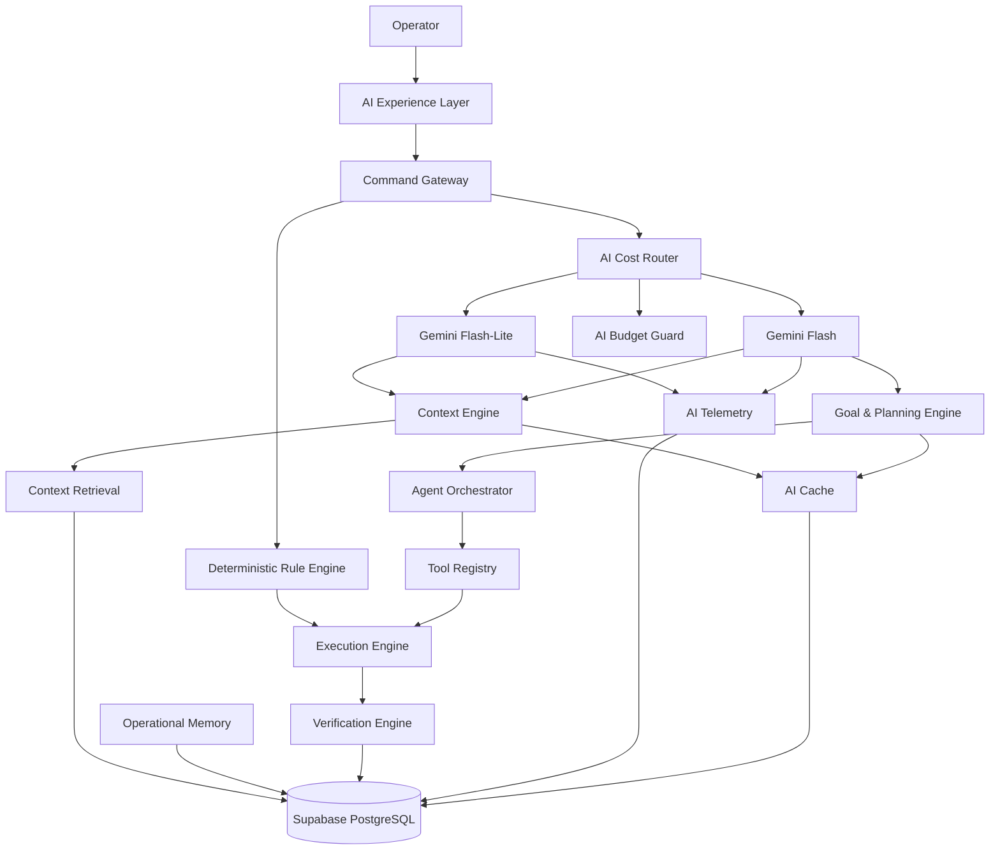

# Erdavid Work OS — AI Intelligence & Token-Efficient Architecture

**Product:** Erdavid Work OS — Mission Control
**Document:** Full Implementation Plan
**Version:** 2.0
**Status:** Architecture & Implementation Specification
**Primary Constraint:** Gemini API Free Tier
**Primary Goal:** Build an intelligent, context-aware, agentic project operations engine while minimizing Gemini token/request consumption.

---

# 1. Executive Summary

Erdavid Work OS currently contains 12 AI subsystems covering:

* Workspace context injection
* Intent recognition
* Model routing
* Feature decomposition
* Vision triage
* Duplicate detection
* ActionPlan generation
* Execution
* Daily insights
* Analytics intelligence
* AI telemetry
* PII/session management

The current architecture is already capable of AI-assisted project management.

However, the next evolution should not be:

> "Send more data to Gemini so the AI becomes smarter."

Instead, the architecture must follow:

> **Make the system intelligent first; use Gemini only when reasoning is actually required.**

The target architecture therefore separates intelligence into four layers:

```text
Deterministic Intelligence
        +
Retrieval Intelligence
        +
LLM Reasoning
        +
Agentic Execution
```

Gemini becomes the **reasoning accelerator**, not the database engine, search engine, calculator, CRUD engine, or state machine.

---

# 2. Primary Objectives

## 2.1 Intelligence Objectives

The AI must be able to:

* Understand natural language in Indonesian and English.
* Understand workspace/project context.
* Retrieve relevant work information.
* Understand project relationships.
* Detect risks.
* Explain project health.
* Generate plans.
* Recommend priorities.
* Remember important operational decisions.
* Execute approved actions.
* Verify execution results.
* Recover from failed actions.
* Maintain long-running AI operations.
* Proactively notify users about meaningful risks.

---

# 3. Token Efficiency Objectives

The system must:

1. Avoid unnecessary Gemini calls.
2. Avoid sending raw database data to Gemini.
3. Avoid sending the entire workspace as context.
4. Avoid repeated analysis of unchanged data.
5. Cache AI-generated results.
6. Retrieve only relevant context.
7. Prefer deterministic processing whenever possible.
8. Batch multiple reasoning operations.
9. Limit agent execution loops.
10. Enforce daily AI budgets.
11. Automatically enter conservative mode when quota is near exhaustion.
12. Preserve functionality even when Gemini becomes unavailable.

---

# 4. Core Architectural Principle

The most important design rule:

```text
Database
    ↓
Source of Truth

Application Rules
    ↓
Deterministic Intelligence

Search / Retrieval
    ↓
Context Intelligence

Gemini
    ↓
Reasoning Intelligence

Agent Orchestrator
    ↓
Operational Intelligence
```

Gemini must not become the source of truth.

---

# 5. Intelligence Layer Model

## L0 — Deterministic Intelligence

No LLM required.

Examples:

* List work items.
* Filter work items.
* Sort work items.
* Count work items.
* Calculate overdue tasks.
* Calculate completion percentage.
* Calculate workload.
* Change state.
* Assign work item.
* Create work item.
* Move cycle.
* Read project.
* Read member.
* Resolve exact work item ID.

Target:

```text
Gemini Calls = 0
```

---

## L1 — Lightweight AI

Use Gemini Flash-Lite only when deterministic logic is insufficient.

Examples:

* Ambiguous intent.
* Entity interpretation.
* Short classification.
* Short semantic classification.
* Simple natural-language transformation.
* Short summarization.

Target:

```text
1 lightweight request
```

---

## L2 — Reasoning AI

Use Gemini Flash.

Examples:

* Project summary.
* Risk explanation.
* Recommendation.
* Daily briefing.
* Work prioritization.
* Dependency reasoning.
* Root-cause analysis.

Target:

```text
1 deep request
```

---

## L3 — Agentic Reasoning

Use Gemini Flash only for complex operations.

Examples:

* Feature decomposition.
* Recovery planning.
* Multi-step project planning.
* Autonomous execution planning.
* Complex dependency resolution.
* Cross-project reasoning.

Target:

```text
1–2 controlled LLM calls per agent run
```

---

# 6. Target AI Traffic Distribution

Target production distribution:

```text
100 user interactions

├── 60–75
│   └── Deterministic
│       0 Gemini calls
│
├── 15–25
│   └── Gemini Flash-Lite
│       1 lightweight call
│
└── 5–10
    └── Gemini Flash
        1 deep call
```

This is the primary Free Tier optimization target.

---

# 7. New High-Level Architecture



---

# 8. Context Engine

## Objective

Transform raw workspace data into compact, relevant AI context.

---

## Current Problem

Current implementation primarily passes:

```text
projectId
```

This is insufficient for deep reasoning.

---

## New Context Object

```typescript
interface WorkspaceContext {
  workspace: WorkspaceContextData

  currentUser: UserContext

  project?: ProjectContext

  cycle?: CycleContext

  projects?: ProjectContext[]

  workItems?: WorkItemContext[]

  modules?: ModuleContext[]

  initiatives?: InitiativeContext[]

  members?: MemberContext[]

  dependencies?: DependencyContext[]

  activity?: ActivityContext[]

  comments?: CommentContext[]

  pages?: PageContext[]

  metrics?: MetricsContext

  risks?: RiskContext[]

  recentChanges?: ChangeContext[]

  memories?: MemoryContext[]
}
```

---

# 9. Context Compiler

Never send raw database responses directly to Gemini.

Create:

```text
Context Compiler
```

Flow:

```text
Database
    ↓
Raw Data
    ↓
Normalizer
    ↓
Relevance Filter
    ↓
Summarizer
    ↓
Context Compiler
    ↓
Compact AI Context
```

Example:

Instead of:

```json
{
  "1000 workItems": []
}
```

send:

```json
{
  "project": "BSJ Phase 4",
  "health": 73,
  "completion": 68,
  "overdue": 7,
  "blocked": 4,
  "highPriority": 5,
  "velocityTrend": -12,
  "criticalRisks": [
    "BSJ-124",
    "BSJ-131"
  ]
}
```

---

# 10. Context Retrieval

The system must never load the entire workspace for every AI request.

Flow:

```text
User Query
    ↓
Intent
    ↓
Context Requirements
    ↓
Retriever
    ↓
Relevant Data
    ↓
Context Compiler
    ↓
LLM
```

Example:

User:

```text
Apa yang harus aku kerjakan hari ini?
```

Required context:

```json
{
  "currentUser": true,
  "assignedWorkItems": true,
  "dueDates": true,
  "priority": true,
  "blocked": true,
  "cycle": true
}
```

Only these records are retrieved.

---

# 11. Semantic Retrieval Engine

Create:

```text
src/application/ai/retrieval/
```

Components:

```text
retriever.ts
candidate-filter.ts
semantic-ranker.ts
context-selector.ts
```

Responsibilities:

* Find related work items.
* Find similar bugs.
* Find relevant pages.
* Find relevant decisions.
* Find related dependencies.
* Find historical solutions.

---

# 12. Duplicate Detection Upgrade

Current:

```text
Token similarity
+
Levenshtein
```

Upgrade:

```text
Exact Match
    ↓
Lexical Similarity
    ↓
Candidate Filtering
    ↓
Semantic Similarity
    ↓
Relationship Analysis
```

Example:

```text
"Implement Google OAuth login"

vs

"Add Google authentication provider"
```

Semantic similarity:

```text
0.91
```

Result:

```text
Possible duplicate
```

Gemini should only be used for the final ambiguous cases.

---

# 13. Goal Engine

Current system is intent-driven:

```text
create_issue
update_issue
list_issues
```

Add:

```text
Goal Engine
```

Example:

```text
"Prepare payment gateway for release"
```

Becomes:

```json
{
  "goal": "prepare_payment_gateway_for_release",
  "scope": "BSJ Phase 4",
  "desiredOutcome": "release_ready"
}
```

Then:

```text
Goal
 ↓
Current State
 ↓
Gap Analysis
 ↓
Plan
 ↓
Actions
 ↓
Verification
```

---

# 14. Goal vs Intent

Intent:

```text
create_issue
```

Goal:

```text
prepare_payment_gateway_for_release
```

Intent answers:

> What did the user ask?

Goal answers:

> What outcome does the user want?

This distinction is critical for agentic behavior.

---

# 15. Project State Analyzer

Create:

```text
src/application/ai/state-analysis/
```

Responsibilities:

* Analyze project status.
* Identify blockers.
* Identify overdue work.
* Detect workload imbalance.
* Detect dependency chains.
* Detect cycle risks.
* Detect incomplete requirements.
* Detect abnormal activity.

Output:

```typescript
interface ProjectStateAnalysis {
  health: number

  blockers: RiskItem[]

  overdue: WorkItemSummary[]

  workloadRisks: WorkloadRisk[]

  dependencyRisks: DependencyRisk[]

  deadlineRisks: DeadlineRisk[]

  recommendations: Recommendation[]
}
```

---

# 16. Project Health Reasoning

Health score must be calculated deterministically.

Example:

```text
Completion        30%
Velocity          20%
Overdue           20%
Blocked           15%
Dependencies      10%
Workload           5%
```

Output:

```text
Health = 73
```

Gemini only explains:

```text
Why is health 73?
What should we do?
```

Never ask Gemini to calculate raw metrics that the database can calculate.

---

# 17. Risk Engine

Create:

```text
src/domain/risk/
```

Risk categories:

```text
deadline_risk
dependency_risk
workload_risk
blocker_risk
scope_risk
velocity_risk
assignment_risk
quality_risk
```

Each risk gets:

```typescript
interface Risk {
  id: string
  type: RiskType
  severity: "low" | "medium" | "high" | "critical"
  score: number
  source: string
  entityId: string
  evidence: string[]
}
```

---

# 18. Predictive Risk

Example:

```text
BSJ-124

Completion Probability: 61%

Deadline Risk: HIGH

Impact:
BSJ-128
BSJ-131
BSJ-134
```

The deterministic engine calculates the risk.

Gemini explains it.

---

# 19. Operational Memory

Current session memory:

```text
conversation
```

Add:

```text
Operational Memory
```

Examples:

```text
Project constraints
Technical decisions
Team preferences
Known risks
Known rules
Important historical decisions
```

---

# 20. Memory Types

```text
conversation_memory
project_memory
decision_memory
constraint_memory
preference_memory
technical_memory
risk_memory
```

---

# 21. Decision Memory

Example:

```json
{
  "type": "decision",
  "scope": "project",
  "projectId": "bsj-phase-4",
  "subject": "payment_provider",
  "decision": "Use Xendit",
  "confidence": "high",
  "source": "operator",
  "createdAt": "..."
}
```

Future requests can retrieve this memory.

---

# 22. Memory Retrieval

Never send all memories.

Flow:

```text
Query
 ↓
Memory Search
 ↓
Top Relevant Memories
 ↓
Context Compiler
 ↓
Gemini
```

Target:

```text
3–5 relevant memories
```

---

# 23. AI Cache

Create:

```text
src/infrastructure/ai/cache/
```

Cache:

* Project summaries.
* Daily briefing.
* Health explanations.
* Risk analysis.
* Decomposition results.
* Repeated semantic queries.

Cache key:

```text
hash(
  operation
  +
  relevantDataVersion
  +
  promptVersion
)
```

---

# 24. Cache Invalidation

Invalidate when relevant data changes.

Examples:

```text
Work item status changed
    ↓
Invalidate project health

New blocker
    ↓
Invalidate project risk

Cycle changed
    ↓
Invalidate daily briefing

New project decision
    ↓
Invalidate project memory context
```

---

# 25. Event-Driven Intelligence

Do not generate AI on every page load.

Use events:

```text
WorkItemCreated
WorkItemUpdated
WorkItemCompleted
WorkItemBlocked
CycleStarted
CycleEnded
DeadlineChanged
AssignmentChanged
ProjectHealthChanged
```

Only meaningful events trigger intelligence.

---

# 26. Daily Briefing

Generate once per day.

```text
08:00
    ↓
Analyze workspace
    ↓
Generate briefing
    ↓
Cache
    ↓
Display all day
```

Regenerate only on major changes.

---

# 27. Proactive Intelligence

AI should proactively identify:

```text
Overdue work
Blocking work
Deadline risks
Workload imbalance
Dependency risks
Cycle risks
Project health degradation
```

Example:

```text
MISSION ALERT

BSJ Phase 4 health dropped:
81 → 73

Primary cause:
2 blocked dependencies.

Potential impact:
3 downstream work items.

Recommended action:
Prioritize BSJ-124 today.
```

---

# 28. Cost-Aware AI Router

Create:

```text
src/lib/ai/cost-router.ts
```

Decision:

```text
Query
 ↓
Can rules solve it?
 ├── YES → deterministic
 └── NO
      ↓
Can lightweight model solve it?
 ├── YES → Flash-Lite
 └── NO → Flash
```

---

# 29. Router Policy

```typescript
type AIExecutionLevel =
  | "deterministic"
  | "lite"
  | "deep"
```

Examples:

```text
list_issues          → deterministic
get_issue            → deterministic
update_issue         → deterministic
create_issue         → deterministic
entity_resolution    → lite
simple_summary       → lite
project_summary      → lite
risk_analysis        → deep
decomposition        → deep
recovery_plan        → deep
agent_run            → deep
```

---

# 30. Gemini Model Strategy

Recommended architecture:

```text
gemini-2.5-flash-lite
    ↓
High-volume / lightweight reasoning

gemini-2.5-flash
    ↓
Complex reasoning / agentic planning
```

Google currently describes Gemini 2.5 Flash as suitable for low-latency, high-volume tasks requiring reasoning and agentic use cases.

Gemini 2.5 Flash-Lite is positioned as the smaller, cost-efficient model for high-scale workloads.

The router must remain provider/model agnostic so the system can later switch providers.

---

# 31. AI Budget Manager

Create:

```text
src/infrastructure/ai/budget/
```

Responsibilities:

* Daily request budget.
* Model-specific budget.
* Feature budget.
* User budget.
* Token budget.
* Emergency mode.
* Rate-limit protection.

---

# 32. Budget Schema

```typescript
interface AIBudget {
  date: string

  totalRequests: number

  liteRequests: number

  deepRequests: number

  inputTokens: number

  outputTokens: number

  estimatedCost: number

  quotaPercentage: number

  mode: "normal" | "conservative" | "safe"
}
```

---

# 33. AI Modes

## NORMAL

```text
Deterministic → Rule
L1 → Lite
L2 → Lite
L3 → Flash
```

## CONSERVATIVE

Triggered around:

```text
80% quota usage
```

Policy:

```text
Deterministic → Rule
L1 → Rule/Lite
L2 → Lite
L3 → Lite or restricted
```

## SAFE

Triggered around:

```text
95% quota usage
```

Only:

```text
CRUD
Search
Filtering
Analytics
Deterministic commands
```

Deep reasoning is disabled.

---

# 34. Budget Guard

Every AI call must pass:

```text
BudgetGuard
```

Flow:

```text
AI Request
 ↓
Check daily quota
 ↓
Check model budget
 ↓
Check feature budget
 ↓
Check rate limit
 ↓
ALLOW / DENY / DOWNGRADE
```

Possible response:

```json
{
  "decision": "downgrade",
  "requestedModel": "gemini-2.5-flash",
  "selectedModel": "gemini-2.5-flash-lite",
  "reason": "daily_budget_threshold"
}
```

---

# 35. Agent Orchestrator

Create:

```text
src/application/agents/
```

Core components:

```text
AgentOrchestrator
AgentRun
AgentPlanner
AgentExecutor
AgentVerifier
AgentStateManager
```

---

# 36. Agent Lifecycle

```text
GOAL
 ↓
ANALYZE
 ↓
PLAN
 ↓
REVIEW
 ↓
EXECUTE
 ↓
VERIFY
 ↓
COMPLETE
```

If failure:

```text
VERIFY
 ↓
FAILED
 ↓
DIAGNOSE
 ↓
RETRY
```

Maximum retries:

```text
1–2
```

After that:

```text
HUMAN_REQUIRED
```

---

# 37. Long-Running Agent State

Create:

```text
ai_agent_runs
```

Example:

```json
{
  "id": "RUN-001",
  "goal": "Prepare BSJ release",
  "status": "waiting_approval",
  "currentStep": 4,
  "maxSteps": 6,
  "llmCalls": 1,
  "maxLlmCalls": 2
}
```

If browser closes:

```text
RUN-001
```

remains persistent.

---

# 38. Agent Limits

Every agent run must have:

```text
MAX_STEPS = 3–6
MAX_LLM_CALLS = 1–2
MAX_RETRIES = 2
MAX_EXECUTION_TIME = configurable
```

This prevents infinite agent loops and token leakage.

---

# 39. Tool Registry

Create:

```text
src/application/tools/
```

Structure:

```text
tools/
├── plane/
├── workspace/
├── analytics/
├── memory/
├── github/
└── system/
```

Example:

```typescript
interface AITool {
  name: string

  description: string

  inputSchema: JSONSchema

  riskLevel: "low" | "medium" | "high"

  execute(input: unknown): Promise<ToolResult>
}
```

---

# 40. Plane Tool Registry

```text
listProjects
getProject
listWorkItems
getWorkItem
createWorkItem
updateWorkItem
assignWorkItem
moveWorkItem
createCycle
moveToCycle
createModule
searchWorkspace
```

---

# 41. Risk-Based Tool Execution

## LOW

```text
Read
Search
Analytics
Summary
```

Auto-execute.

## MEDIUM

```text
Create task
Assign task
Change priority
Move cycle
```

Human review recommended.

## HIGH

```text
Delete
Bulk mutations
Project settings
External actions
```

Explicit approval required.

---

# 42. ActionPlan v2

Current:

```text
ANALYZE
PLAN
REVIEW
EXECUTE
```

Upgrade:

```text
ANALYZE
 ↓
CONTEXT
 ↓
PLAN
 ↓
RISK
 ↓
REVIEW
 ↓
EXECUTE
 ↓
VERIFY
 ↓
MEMORY
```

Example:

```text
● ANALYZE
● CONTEXT
● PLAN
● RISK
● REVIEW
○ EXECUTE
○ VERIFY
○ MEMORY
```

---

# 43. Verification Engine

Never trust HTTP 200 as success.

Example:

```text
Update BSJ-123 → Done
        ↓
API 200
        ↓
GET BSJ-123
        ↓
state == Done?
```

If yes:

```text
VERIFIED
```

If no:

```text
FAILED
```

---

# 44. Verification Strategies

```text
read-after-write
state validation
entity validation
count validation
dependency validation
permission validation
```

---

# 45. Recovery Engine

If action fails:

```text
Failure
 ↓
Classify
 ↓
Retry?
 ├── YES
 │    ↓
 │  Retry once
 │
 └── NO
      ↓
 Human intervention
```

Failure categories:

```text
validation_error
permission_error
not_found
rate_limit
network_error
conflict
unknown
```

---

# 46. Conversation Architecture

Conversation remains important, but it must not become the source of truth.

```text
Conversation
    ↓
Intent
    ↓
Goal
    ↓
Action
    ↓
Persistent Work Item / Agent Run
```

Chat history is context.

Work items and agent runs are operational state.

---

# 47. Prompt Architecture

Use modular prompts.

```text
SYSTEM PROMPT
+
ROLE PROMPT
+
TASK PROMPT
+
RELEVANT CONTEXT
+
OUTPUT SCHEMA
```

Never create one massive system prompt containing the entire application.

---

# 48. Prompt Budget

Target:

```text
System instructions:
~500–1000 tokens

Task instructions:
~100–300 tokens

Context:
~300–1500 tokens

Output:
~100–500 tokens
```

Exact budgets should be measured through telemetry rather than assumed.

---

# 49. Structured Output

All machine-consumed AI responses must use strict schemas.

Example:

```typescript
interface ProjectAnalysis {
  healthExplanation: string
  risks: Risk[]
  recommendations: Recommendation[]
}
```

Avoid free-form AI output for execution-critical operations.

---

# 50. PII Scrubber

Existing PII protection remains.

Improve detection for:

```text
API keys
access tokens
JWT
passwords
cookies
authorization headers
private URLs
database credentials
webhook secrets
```

PII/security scrubbing must occur before model invocation.

---

# 51. AI Request Pipeline

Final request flow:

```text
User Input
 ↓
Authentication
 ↓
Rate Limit
 ↓
PII Scrubber
 ↓
Intent Detection
 ↓
Cost Router
 ↓
Budget Guard
 ↓
Context Requirements
 ↓
Context Retrieval
 ↓
Context Compiler
 ↓
Prompt Builder
 ↓
Gemini
 ↓
Structured Output Validation
 ↓
Action / Response
 ↓
Verification
 ↓
Telemetry
 ↓
Memory / Cache
```

---

# 52. AI Telemetry

Current telemetry should be expanded.

Track:

```text
request_id
session_id
user_id
feature
intent
goal
model
route
input_tokens
output_tokens
thinking_tokens
latency
status
error
cache_hit
cache_miss
context_size
estimated_cost
agent_run_id
tool_calls
retry_count
```

---

# 53. Feature-Level Token Analytics

Dashboard:

```text
AI Usage

Today
────────────────────────

Total Requests       327
Gemini Calls         94
Deterministic        233

Flash-Lite           72
Flash                22

Input Tokens         48,210
Output Tokens        11,302

Cache Hit Rate       68%

Estimated Cost       $0.00
```

---

# 54. Token Efficiency KPI

Add:

```text
AI Efficiency Score
```

Formula:

```text
deterministicRequests
/
totalRequests
```

Example:

```text
233 / 327 = 71.2%
```

Goal:

```text
> 70%
```

---

# 55. AI Quality KPI

Do not optimize only for low tokens.

Track:

```text
successful_actions
failed_actions
user_corrections
plan_acceptance_rate
verification_success_rate
duplicate_detection_accuracy
recommendation_acceptance
```

---

# 56. Cost vs Quality Dashboard

Track:

```text
Feature
Requests
Tokens
Latency
Success Rate
User Corrections
```

Example:

```text
Feature: Decomposition

Calls: 12
Tokens: 8,120
Success: 91%
Correction: 9%
```

---

# 57. Caching Strategy

Cache levels:

```text
L1:
Request-level cache

L2:
Session cache

L3:
Project intelligence cache

L4:
Daily briefing cache
```

---

# 58. Cache Safety

Never cache:

```text
private user-specific responses
sensitive credentials
authorization decisions
temporary security data
```

Cache only safe derived intelligence.

---

# 59. Batch Reasoning

Avoid:

```text
20 tasks
→ 20 AI requests
```

Prefer:

```text
20 tasks
→ 1 AI request
→ 20 classifications
```

Use structured arrays.

---

# 60. Vision Token Protection

Vision requests are expensive relative to deterministic operations.

Only invoke Vision when:

```text
image attached
AND
image analysis is actually required
```

Preprocess:

```text
resize
crop
compress
remove irrelevant UI
```

If screenshot contains multiple regions:

```text
UI crop
Console crop
Error crop
```

rather than repeatedly sending the full screenshot.

---

# 61. Vision Pipeline

```text
Screenshot
 ↓
Preprocessor
 ↓
Image Optimization
 ↓
Gemini Vision
 ↓
Structured Bug Report
 ↓
Duplicate Check
 ↓
ActionPlan
```

One request whenever possible.

---

# 62. Daily Briefing Token Strategy

Do not generate independently for:

```text
Dashboard
Mobile
Notification
Chat
```

Generate one canonical briefing:

```text
DailyBriefing
```

Then reuse it everywhere.

---

# 63. Project Summary Token Strategy

Project summary should use:

```text
ProjectMetrics
+
RecentChanges
+
RiskSummary
+
CachedExplanation
```

Only regenerate explanation when meaningful state changes.

---

# 64. AI Context Versioning

Create:

```text
context_version
```

Example:

```text
project BSJ
context_version = 104
```

If nothing relevant changes:

```text
context_version = 104
```

Cached AI output remains valid.

If relevant data changes:

```text
context_version = 105
```

Cache invalidates.

---

# 65. AI Memory Versioning

Each memory must include:

```text
memory_version
confidence
source
scope
created_at
updated_at
expires_at
```

Avoid stale decisions.

---

# 66. Memory Expiration

Some memories should expire.

Example:

```text
"Use Xendit"
```

may be permanent.

But:

```text
"Andi is unavailable this week"
```

should expire.

Use:

```text
expires_at
```

---

# 67. Multi-Agent Strategy

Do not initially implement many agents.

Phase 1:

```text
Workspace Intelligence Agent
Planning Agent
Execution Agent
Risk Agent
```

Future:

```text
QA Agent
Documentation Agent
Release Agent
Research Agent
```

---

# 68. Workspace Intelligence Agent

Responsibilities:

```text
Analyze workspace
Identify important changes
Identify risks
Generate summaries
Generate daily briefing
```

---

# 69. Planning Agent

Responsibilities:

```text
Understand goal
Analyze state
Find dependencies
Build task graph
Generate plan
```

---

# 70. Execution Agent

Responsibilities:

```text
Execute approved actions
Call tools
Verify results
Handle errors
Record evidence
```

---

# 71. Risk Agent

Responsibilities:

```text
Detect deadline risks
Dependency risks
Workload risks
Velocity anomalies
Project health degradation
```

---

# 72. Task Graph

Planning must generate dependency-aware plans.

Example:

```text
Payment API
   ↓
Webhook
   ↓
Integration
   ↓
QA
   ↓
Release
```

The agent must not recommend:

```text
QA
```

before:

```text
Integration
```

is completed.

---

# 73. Evidence-Based AI

Every recommendation should contain evidence.

Example:

```text
Recommendation:
Prioritize BSJ-124.

Evidence:
- 2 days overdue
- High priority
- Blocks 3 work items
- Current cycle ends in 3 days
```

This reduces hallucination.

---

# 74. AI Confidence

Every AI-derived recommendation should include:

```text
confidence:
high
medium
low
```

Low-confidence recommendations should require human review.

---

# 75. Hallucination Protection

AI must never invent:

```text
work item ID
member ID
project ID
state ID
deadline
metric
dependency
```

All entities must be resolved against actual database records.

---

# 76. Entity Resolution

Current fuzzy resolver remains.

Upgrade:

```text
Exact ID
 ↓
Exact name
 ↓
Alias
 ↓
Fuzzy matching
 ↓
Semantic matching
 ↓
Ambiguous?
    ↓
Ask user
```

Never guess when multiple records match.

---

# 77. Example Entity Resolution

User:

```text
assign task payment ke David
```

Resolver:

```text
David
├── David Putra
├── David Santoso
└── David Wijaya
```

AI must not randomly choose.

Response:

```text
Ada 3 member bernama David.
Pilih:
1. David Putra
2. David Santoso
3. David Wijaya
```

---

# 78. Free Tier Failure Handling

Possible Gemini errors:

```text
429
RESOURCE_EXHAUSTED
timeout
network failure
invalid response
schema failure
```

Fallback:

```text
Gemini failure
 ↓
Retry once if safe
 ↓
Downgrade model if possible
 ↓
Deterministic fallback
 ↓
Human-readable response
```

---

# 79. No-AI Degradation

When Gemini is unavailable, application must still support:

```text
List
Search
Create
Update
Assign
Filter
Analytics
Dashboard
Task management
```

Only advanced reasoning disappears.

---

# 80. Security Boundary

AI must never directly access Supabase credentials or Plane credentials.

Architecture:

```text
AI
 ↓
Tool Registry
 ↓
Permission Check
 ↓
Service Layer
 ↓
Plane API
```

---

# 81. Authorization

Every tool execution must verify:

```text
user
workspace
project
role
permission
entity ownership
```

AI must not bypass application authorization.

---

# 82. Audit Trail

Every AI mutation must log:

```text
who requested
what AI proposed
what user approved
what tool executed
what changed
verification result
```

Example:

```text
AI Action

User:
Erdin

Requested:
Move BSJ-124 to Done

Approved:
Yes

Executed:
2026-08-21 10:42

Verified:
Yes
```

---

# 83. Database Additions

Recommended tables:

```text
ai_agent_runs
ai_agent_steps
ai_tool_calls
ai_memories
ai_decisions
ai_context_snapshots
ai_cache
ai_budgets
ai_risk_events
ai_recommendations
```

Existing:

```text
ai_sessions
ai_messages
ai_usage
```

remain.

---

# 84. `ai_agent_runs`

```text
id
workspace_id
user_id
goal
status
current_step
max_steps
llm_calls
max_llm_calls
started_at
completed_at
error
```

---

# 85. `ai_agent_steps`

```text
id
agent_run_id
step_number
type
input
output
status
tool_name
started_at
completed_at
```

---

# 86. `ai_memories`

```text
id
workspace_id
project_id
type
subject
content
confidence
source
expires_at
created_at
updated_at
```

---

# 87. `ai_context_snapshots`

```text
id
workspace_id
project_id
context_hash
context_version
token_estimate
created_at
```

---

# 88. `ai_cache`

```text
id
cache_key
feature
scope
data_hash
response
model
prompt_version
expires_at
created_at
```

---

# 89. `ai_budgets`

```text
id
date
workspace_id
total_requests
lite_requests
deep_requests
input_tokens
output_tokens
estimated_cost
mode
```

---

# 90. `ai_risk_events`

```text
id
workspace_id
project_id
entity_id
risk_type
severity
score
evidence
status
created_at
resolved_at
```

---

# 91. API Architecture

Recommended endpoints:

```text
/api/ai/chat
/api/ai/intent
/api/ai/context
/api/ai/reason
/api/ai/plan
/api/ai/execute
/api/ai/verify
/api/ai/agents
/api/ai/agents/:id
/api/ai/memory
/api/ai/recommendations
/api/ai/risks
/api/ai/briefing
/api/ai/budget
/api/ai/telemetry
```

---

# 92. AI Request Contract

```typescript
interface AIRequest {
  sessionId?: string

  userId: string

  workspaceId: string

  projectId?: string

  input: string

  requestedCapability?: string

  allowExecution?: boolean
}
```

---

# 93. AI Response Contract

```typescript
interface AIResponse {
  requestId: string

  type:
    | "answer"
    | "action_plan"
    | "recommendation"
    | "agent_run"
    | "clarification"

  content: string

  actions?: Action[]

  confidence?: number

  citations?: Evidence[]

  usage?: AIUsage
}
```

---

# 94. Prompt Versioning

Every prompt must have:

```text
prompt_id
prompt_version
model
temperature
schema_version
```

Example:

```text
project-risk-v3
decomposition-v4
daily-briefing-v2
```

This allows regression testing.

---

# 95. AI Evaluation System

Create test datasets:

```text
intent-tests.json
entity-resolution-tests.json
decomposition-tests.json
risk-tests.json
project-summary-tests.json
```

---

# 96. Intent Evaluation

Test:

```text
tampilkan task ku
lihat tugas saya
apa task saya hari ini
list task BSJ
show my urgent tasks
```

Expected:

```text
list_issues
```

---

# 97. Entity Resolution Evaluation

Test:

```text
bsj
BSJ 4
bsj phase 4
BSJ Phase 4
```

All should resolve to the same project.

---

# 98. Agent Evaluation

Test:

```text
Prepare payment gateway for release.
```

Expected:

```text
Analyze
Find gaps
Build dependency graph
Generate plan
Request approval
Execute
Verify
```

---

# 99. Token Regression Test

Every AI feature must record:

```text
expected_input_tokens
expected_output_tokens
max_tokens
```

CI should flag unexpected increases.

Example:

```text
project-summary

Expected:
< 1500 input tokens

Actual:
4800

Result:
FAIL
```

---

# 100. Build Verification

Run:

```bash
npm run build
```

Also:

```bash
npm run lint
npm run test
```

If available:

```bash
npm run test:e2e
```

---

# 101. Token Leak Test

Simulate:

```text
100 user interactions
```

Verify:

```text
Gemini calls <= target
Input tokens <= target
Output tokens <= target
No infinite retries
No repeated duplicate requests
```

---

# 102. Agent Loop Test

Force tool failure.

Expected:

```text
Attempt 1
 ↓
Failure
 ↓
Retry
 ↓
Failure
 ↓
STOP
 ↓
Human required
```

Never:

```text
retry
retry
retry
retry
...
```

---

# 103. Cache Test

Run:

```text
same request × 10
```

Expected:

```text
Gemini calls = 1
Cache hits = 9
```

---

# 104. Deterministic Routing Test

Run:

```text
"tampilkan task saya"
```

Expected:

```text
Gemini calls = 0
```

---

# 105. Budget Test

Simulate:

```text
80%
```

Expected:

```text
conservative mode
```

Simulate:

```text
95%
```

Expected:

```text
safe mode
```

---

# 106. Implementation Phases

## Phase 1 — AI Cost Foundation

Implement:

```text
Cost Router
Budget Guard
Model abstraction
Token telemetry
AI modes
```

Priority:

**CRITICAL**

---

# 107. Phase 2 — Deterministic Intelligence

Move as many operations as possible out of Gemini.

Implement:

```text
Rule Engine
Entity Resolver
Analytics Engine
Command Parser
CRUD executor
```

Target:

```text
60–75% interactions
→ 0 Gemini calls
```

---

# 108. Phase 3 — Context Engine

Implement:

```text
Context Requirements
Context Retriever
Context Compiler
Context Hash
Context Version
```

Target:

```text
No full-workspace prompts.
```

---

# 109. Phase 4 — AI Cache

Implement:

```text
Project summary cache
Daily briefing cache
Risk analysis cache
Semantic result cache
```

Target:

```text
> 60% cache hit rate
```

---

# 110. Phase 5 — Operational Memory

Implement:

```text
Project memory
Decision memory
Constraint memory
Risk memory
Memory retrieval
Memory expiration
```

---

# 111. Phase 6 — Goal Engine

Implement:

```text
Intent
 ↓
Goal
 ↓
Current State
 ↓
Gap Analysis
```

This becomes the foundation for agentic behavior.

---

# 112. Phase 7 — Risk Intelligence

Implement:

```text
Deadline risk
Dependency risk
Workload risk
Velocity risk
Project health reasoning
```

---

# 113. Phase 8 — Agent Orchestrator

Implement:

```text
Agent Run
Agent Steps
Tool Registry
Execution
Verification
Recovery
```

Keep strict limits.

---

# 114. Phase 9 — Proactive Intelligence

Implement:

```text
Daily briefing
Mission alerts
Risk alerts
Cycle alerts
Workload alerts
```

Event-driven only.

---

# 115. Phase 10 — Multi-Agent Expansion

Only after the previous phases are stable:

```text
Planning Agent
Risk Agent
Execution Agent
QA Agent
Documentation Agent
Release Agent
```

---

# 116. Recommended File Structure

```text
src/
├── application/
│   ├── ai/
│   │   ├── context/
│   │   ├── retrieval/
│   │   ├── memory/
│   │   ├── planning/
│   │   ├── risk/
│   │   └── reasoning/
│   │
│   ├── agents/
│   │   ├── orchestrator.ts
│   │   ├── planner.ts
│   │   ├── executor.ts
│   │   ├── verifier.ts
│   │   └── state-manager.ts
│   │
│   └── tools/
│       ├── plane/
│       ├── workspace/
│       └── analytics/
│
├── domain/
│   ├── risk/
│   ├── memory/
│   ├── work_items/
│   └── analytics/
│
├── infrastructure/
│   ├── ai/
│   │   ├── providers/
│   │   ├── router/
│   │   ├── budget/
│   │   ├── cache/
│   │   └── telemetry/
│   │
│   └── plane/
│
└── app/
    └── api/
        └── ai/
```

---

# 117. Existing Modules Migration

## Existing

```text
intent-engine.ts
router.ts
decomposition.ts
duplicate-detection.ts
executor.ts
InsightService.ts
analytics-helper.ts
ai-usage-logger.ts
pii-scrubber.ts
```

## Migration

### `intent-engine.ts`

Become:

```text
Intent Detector
+
Command Classifier
```

### `router.ts`

Become:

```text
Cost-Aware AI Router
```

### `decomposition.ts`

Become:

```text
Planning Engine
```

### `duplicate-detection.ts`

Become:

```text
Semantic Retrieval + Duplicate Engine
```

### `executor.ts`

Become:

```text
Agent Execution Engine
```

### `InsightService.ts`

Become:

```text
Proactive Intelligence Service
```

### `analytics-helper.ts`

Become:

```text
Project Intelligence Engine
```

### `ai-usage-logger.ts`

Become:

```text
AI Telemetry + Budget System
```

---

# 118. Final AI Architecture

```text
                    ERDAVID WORK OS
                       MISSION CONTROL

                           USER
                            │
                            ▼
                   ┌─────────────────┐
                   │ Command Gateway  │
                   └────────┬────────┘
                            │
                  ┌─────────┴─────────┐
                  │                   │
                  ▼                   ▼
          Deterministic Brain     AI Router
                  │                   │
                  │            ┌──────┴──────┐
                  │            ▼             ▼
                  │          LITE          FLASH
                  │            │             │
                  └────────────┴─────────────┘
                               │
                               ▼
                       CONTEXT ENGINE
                               │
                ┌──────────────┼──────────────┐
                ▼              ▼              ▼
           Retrieval        Memory        Project State
                │              │              │
                └──────────────┼──────────────┘
                               ▼
                         GOAL ENGINE
                               │
                               ▼
                      AGENT ORCHESTRATOR
                               │
                ┌──────────────┼──────────────┐
                ▼              ▼              ▼
             PLAN           TOOLS          RISK
                │              │              │
                └──────────────┼──────────────┘
                               ▼
                         EXECUTION
                               │
                               ▼
                         VERIFICATION
                               │
                         ┌─────┴─────┐
                         ▼           ▼
                       SUCCESS     FAILURE
                         │           │
                         ▼           ▼
                      MEMORY      RECOVERY
                         │           │
                         └─────┬─────┘
                               ▼
                         TELEMETRY
                               │
                               ▼
                         BUDGET GUARD
```

---

# 119. Final Design Principles

## Principle 1

> **Do not use AI when code can solve the problem.**

---

## Principle 2

> **Do not send context that the AI does not need.**

---

## Principle 3

> **Do not recompute intelligence that has not changed.**

---

## Principle 4

> **Do not allow agents to run indefinitely.**

---

## Principle 5

> **Every AI mutation must be verifiable.**

---

## Principle 6

> **Every AI recommendation should have evidence.**

---

## Principle 7

> **Every expensive AI operation must pass through Budget Guard.**

---

## Principle 8

> **Conversation is context; persistent work state is the source of truth.**

---

## Principle 9

> **Gemini is a reasoning layer, not the entire application.**

---

# 120. Success Criteria

The implementation is considered successful when:

```text
✓ 60–75% normal commands use 0 Gemini calls

✓ AI context is dynamically retrieved

✓ No full workspace payloads are sent unnecessarily

✓ Project summaries are cached

✓ Daily briefings are cached

✓ Operational memory works

✓ Decision memory works

✓ Goal-based planning works

✓ Risk engine detects meaningful risks

✓ Agent runs have hard limits

✓ Agent execution is verifiable

✓ Failed actions stop safely

✓ AI budget automatically downgrades

✓ Application remains functional when Gemini quota is exhausted

✓ AI telemetry reports exact usage

✓ AI recommendations include evidence

✓ Entity resolution never silently chooses ambiguous entities

✓ Prompt versions are traceable

✓ Token regression tests exist
```

---

# 121. Final Product Vision

The final Erdavid Work OS should not feel like:

> "A project management app with a Gemini chatbot."

It should feel like:

> **"An intelligent operational layer that understands the state of my work and helps me decide what should happen next."**

The fundamental loop becomes:

```text
UNDERSTAND
    ↓
RETRIEVE
    ↓
REASON
    ↓
PLAN
    ↓
REVIEW
    ↓
EXECUTE
    ↓
VERIFY
    ↓
REMEMBER
    ↓
MONITOR
    ↓
UNDERSTAND AGAIN
```

While the token-efficient loop remains:

```text
Can code solve it?
      │
     YES
      ↓
   0 tokens

     NO
      ↓
Can retrieval/rules solve it?
      │
     YES
      ↓
   0 tokens

     NO
      ↓
Can Lite solve it?
      │
     YES
      ↓
  Flash-Lite

     NO
      ↓
Complex reasoning
      ↓
    Flash
```

This architecture allows Erdavid Work OS to become significantly more intelligent without making Gemini responsible for every interaction.

The goal is therefore not to maximize AI usage.

The goal is:

> **Maximum operational intelligence per Gemini token.**